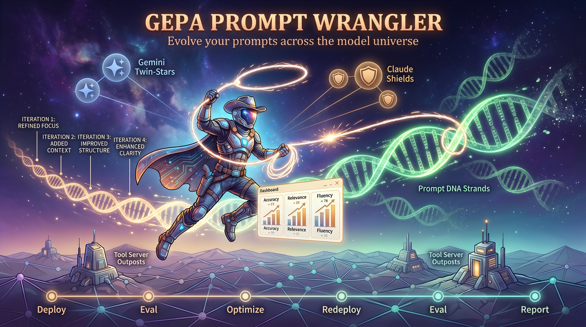

# GEPA Prompt Wrangler



A prompt optimization harness for [Google ADK](https://google.github.io/adk-docs/) agents. Define multiple model + system-prompt pairs in a YAML manifest, evaluate them against a shared eval set, optimize with GEPA, and deploy the winners to the Gemini Enterprise Agent Platform (GEAP).

---

## Default Workflow

```
1. Deploy      Deploy agent(s) to GEAP
2. Eval        Run batch eval against deployed agent (baseline)
3. Optimize    Run local GEPA optimization with eval dataset
4. Redeploy    Update agent with optimized prompt
5. Re-eval     Run batch eval again (measure improvement)
6. Report      Generate comparative analysis report
```

Run the full pipeline in one command:

```bash
wrangler run manifest.yaml
```

Or step by step:

```bash
wrangler deploy manifest.yaml
wrangler eval manifest.yaml --engine-id <ID>
wrangler optimize manifest.yaml
wrangler deploy manifest.yaml --pair gemini-flash
wrangler report outputs/
```

---

## Quick Start

```bash
# Clone the repo
git clone https://github.com/tottenjordan/gepa-prompt-wrangler.git
cd gepa-prompt-wrangler

# Install dependencies
uv sync

# Configure environment
cp .env.example .env
# Edit .env with your GCP project, region, and staging bucket

# Generate a starter manifest
wrangler init

# Inspect an agent's tools
wrangler inspect agents/example_agent

# Run the full pipeline
wrangler run manifests/example_manifest.yaml
```

### Multi-Model Example (End-to-End)

```bash
# Step 1: Configure environment
cd examples/multi_model_agents
cp .env.example .env
# Edit .env with your GCP project ID, region, and project number

# Step 2: Deploy MCP tool servers (wrangler-prefixed Cloud Run services)
bash scripts/deploy_mcp_servers.sh

# Step 3: Deploy all 5 agents to Agent Engine
cd ../..
uv run python examples/multi_model_agents/deploy_agents.py

# Step 4: Setup monitoring (logging sink + online evaluators)
bash examples/multi_model_agents/scripts/setup_monitoring.sh

# Step 5: Run the full optimization experiment
wrangler run examples/multi_model_agents/manifest.yaml
```

See [examples/multi_model_agents/README.md](examples/multi_model_agents/README.md) for detailed walkthrough.
See [docs/online_eval_guide.md](docs/online_eval_guide.md) for evaluators vs monitors.

---

## Repository Structure

```
gepa-prompt-wrangler/
├── pyproject.toml
├── .env.example
│
├── wrangler/                        # Core library
│   ├── cli.py                       # Click CLI (init, inspect, run, eval, optimize, report, deploy)
│   ├── config.py                    # GCP config, resolve_model(), MODEL_COSTS, disable_pyopenssl()
│   ├── analysis.py                  # Per-agent markdown report generator
│   ├── factory.py                   # Manifest parser, AgentPromptPair dataclass
│   ├── converter.py                 # YAML ↔ ADK evalset format auto-conversion
│   ├── evaluator.py                 # Batch eval against deployed GEAP agents (6 metrics)
│   ├── optimizer.py                 # GEPA wrapper with ADK patches
│   ├── runner.py                    # Full 6-phase pipeline orchestrator
│   ├── reporter.py                  # Matplotlib charts + markdown report generation
│   ├── deploy.py                    # Deploy/update agents on GEAP
│   └── inspector.py                 # Auto-discover agent tools via introspection
│
├── agents/                          # User-defined agent modules
│   └── example_agent/               # Example travel agent with mock tools
│
├── manifests/                       # Experiment configs
│   └── example_manifest.yaml        # 2-pair example (Gemini Flash vs Claude Sonnet)
│
├── eval_data/                       # Eval datasets
│   └── example_eval.yaml            # 5 simplified eval cases
│
├── scripts/                         # Analysis & visualization
│   ├── generate_analysis.py         # Matplotlib charts + per-agent reports
│   ├── generate_diagrams.py         # PaperBanana architecture diagrams
│   └── run_full_analysis.py         # Master script chaining all analysis
│
├── examples/                        # Reference implementations
│   └── multi_model_agents/          # Full 5-model comparison (lite → opus)
│       ├── manifest.yaml
│       ├── run_demo.py              # E2E demo: generic → eval → optimize → eval
│       ├── deploy_agents.py         # Deploy all agents to GEAP
│       ├── generic_prompts.py       # Intentionally weak starting prompts
│       ├── agents/                  # 5 standalone agents
│       ├── mcp_servers/             # 3 MCP tool servers (Cloud Run + OTel)
│       ├── eval_data/               # 30 eval cases (low/medium/high)
│       └── scripts/                 # Infrastructure deployment
│
├── outputs/                         # Generated artifacts (gitignored)
│   ├── baselines/                   # Pre-optimization eval results
│   ├── optimized/                   # Post-optimization eval results
│   ├── prompts/                     # Before/after prompt snapshots
│   └── reports/                     # Markdown reports + charts
│
├── docs/
│   ├── gepa_prompt_wrangler_banner.png
│   └── diagram_sources/             # PaperBanana diagram descriptions
│
└── tests/
    ├── test_factory.py              # Manifest parsing tests
    └── test_converter.py            # Eval format conversion tests
```

---

## Manifest Format

```yaml
name: travel-agent-model-comparison
description: Compare Gemini Flash vs Claude Sonnet on travel agent tasks

agent_module: agents/example_agent
eval_data: eval_data/example_eval.yaml

pairs:
  - id: gemini-flash
    model: gemini-3.5-flash
    system_prompt: |
      You are a corporate travel assistant.
      Use tools to search flights and book hotels.

  - id: claude-sonnet
    model: claude-sonnet-4-6
    system_prompt: |
      You are a corporate travel assistant.
      Use tools to search flights and book hotels.

eval_config:
  judge_model: gemini-2.5-pro
  response_match_threshold: 0.5
  safety_threshold: 0.8

deploy:
  project: my-gcp-project
  region: us-central1
  staging_bucket: my-staging-bucket
```

### Required Fields

| Field | Description |
|-------|-------------|
| `name` | Unique name for this experiment |
| `agent_module` | Path to the agent module directory |
| `pairs` | List of model + system-prompt pairs |
| `pairs[].id` | Unique identifier for the pair |
| `pairs[].model` | Model string (see Supported Models) |
| `pairs[].system_prompt` | System prompt text |

---

## Eval Data Formats

### Simplified YAML (recommended)

```yaml
eval_cases:
  - prompt: "Find flights from SFO to JFK"
    expected_response: "Flights from SFO to JFK: United FL001 at $450."
    expected_tools:
      - name: search_flights
        args: {origin: SFO, destination: JFK}

  - prompt: "Book flight FL001 for Alice Johnson"
    expected_response: "Flight FL001 booked and confirmed."
    expected_tools:
      - name: book_flight
        args: {flight_id: FL001, passenger_name: "Alice Johnson"}
```

### ADK Evalset JSON

```json
{
  "eval_set_id": "my_eval",
  "eval_cases": [
    {
      "eval_id": "flight_search",
      "conversation": [
        {
          "user_content": {"parts": [{"text": "Find flights from SFO to JFK"}], "role": "user"},
          "final_response": {"parts": [{"text": "Flights found."}], "role": "model"},
          "intermediate_data": {"tool_uses": [{"name": "search_flights", "args": {"origin": "SFO"}}]}
        }
      ]
    }
  ]
}
```

The converter auto-detects the format. Use simplified YAML for authoring, ADK JSON for advanced tool-use evaluation.

---

## CLI Commands

| Command | Description |
|---------|-------------|
| `wrangler init` | Create a starter manifest.yaml |
| `wrangler inspect <agent_path>` | Auto-discover agent tools, generate YAML scaffold |
| `wrangler run <manifest>` | Full pipeline: deploy → eval → optimize → redeploy → eval → report |
| `wrangler eval <manifest>` | Run batch eval against a deployed agent |
| `wrangler optimize <manifest>` | Run GEPA optimization for each pair |
| `wrangler report <outputs_dir>` | Generate analysis report from results |
| `wrangler deploy <manifest>` | Deploy agent pairs to GEAP |

### Options

```bash
wrangler run manifest.yaml --dry-run       # Validate without executing
wrangler deploy manifest.yaml --pair flash  # Deploy specific pair
wrangler eval manifest.yaml --engine-id ID  # Eval against specific engine
```

---

## Evaluation Metrics

### Default metrics (6)

| Metric | What it measures |
|--------|-----------------|
| `final_response_quality` | Overall response quality |
| `hallucination` | Factual accuracy |
| `safety` | Content safety |
| `tool_use_quality` | Correct tool selection and parameters |
| `instruction_following` | Adherence to system prompt |
| `final_response_match` | Match against reference response |

### GEPA optimization metrics

| Metric | Purpose |
|--------|---------|
| `response_match_score` | Primary optimization target |
| `final_response_match_v2` | LLM-judged similarity (uses judge model) |
| `safety_v1` | Constraint — don't sacrifice safety for quality |

---

## Supported Models

| Model | Provider | Endpoint | Input $/M | Output $/M |
|-------|----------|----------|----------|-----------|
| `gemini-2.5-flash` | Google | Regional | — | — |
| `gemini-3.1-flash-lite` | Google | Global (LiteLLM) | $0.25 | $1.50 |
| `gemini-3.5-flash` | Google | Global (LiteLLM) | $1.50 | $1.65 |
| `gemini-3.1-pro-preview` | Google | Global (LiteLLM) | $4.00 | $18.00 |
| `claude-sonnet-4-6` | Anthropic | Global (LiteLLM) | $3.00 | $15.00 |
| `claude-opus-4-6` | Anthropic | Global (LiteLLM) | $5.00 | $25.00 |

*Source: [GEAP Model Pricing](https://cloud.google.com/gemini-enterprise-agent-platform/generative-ai/pricing)*

Gemini 2.x uses regional Vertex AI endpoints (passed as strings). All other models route through `LiteLlm` with `vertex_location="global"`.

---

## Examples

### Multi-Model Comparison (5 tiers)

Full end-to-end example comparing lite → flash → pro → sonnet → opus on the same travel/expense agent with shared MCP tools.

```bash
# Deploy wrangler-prefixed MCP servers
bash examples/multi_model_agents/scripts/deploy_mcp_servers.sh

# Run the experiment
wrangler run examples/multi_model_agents/manifest.yaml
```

See [examples/multi_model_agents/README.md](examples/multi_model_agents/README.md) for details.

### Agent Inspection

```bash
# Auto-discover tools from an existing agent
wrangler inspect agents/example_agent

# Output:
# agent:
#   name: example_travel_agent
#   tools:
#     - name: search_flights
#       description: Search available flights
#       parameters:
#         origin: {type: string, required: true}
#         destination: {type: string, required: true}
```

### Python API

```python
from wrangler.factory import PairFactory
from wrangler.converter import load_eval_file
from wrangler.evaluator import run_batch_eval

# Parse manifest
manifest = PairFactory.load("manifest.yaml")

# Load eval cases (auto-detects format)
cases = load_eval_file("eval_data/my_eval.yaml")

# Run eval against deployed agent
scores = run_batch_eval(engine_id="1234567890", eval_cases=cases)
print(scores)
# {'final_response_quality_v1': 0.85, 'hallucination_v1': 0.94, ...}
```

---

## Contributing

1. Fork the repository and create a feature branch.
2. Install dev dependencies: `uv sync`.
3. Write tests: `tests/test_*.py`.
4. Run tests: `uv run pytest`.
5. Submit a pull request.

---

## FAQ

**Q: Do I need a GCP project?**
A: Yes. The harness deploys agents to Vertex AI Agent Engine and uses Vertex AI models for evaluation and GEPA optimization.

**Q: Can I use non-Vertex AI models?**
A: Currently supports Gemini and Claude via Vertex AI. Extend `resolve_model()` in `config.py` to add other LiteLLM-supported providers.

**Q: What is GEPA?**
A: Gemini Evolutionary Prompt Algorithm — an evolutionary optimization algorithm that iteratively improves agent system prompts by generating variants, evaluating them against your eval dataset, and selecting the best performers across generations.

**Q: How do I use my own agent?**
A: Create a directory under `agents/` with an `__init__.py` that exports `agent.root_agent` (an ADK `LlmAgent`), then set `agent_module` in your manifest. Or implement a `create_agent(model, instruction)` factory function for dynamic model/prompt injection.

**Q: What's the difference between `run` and `deploy`?**
A: `run` executes the full 6-phase pipeline (deploy → eval → optimize → redeploy → eval → report). `deploy` just deploys agents without evaluation or optimization.
