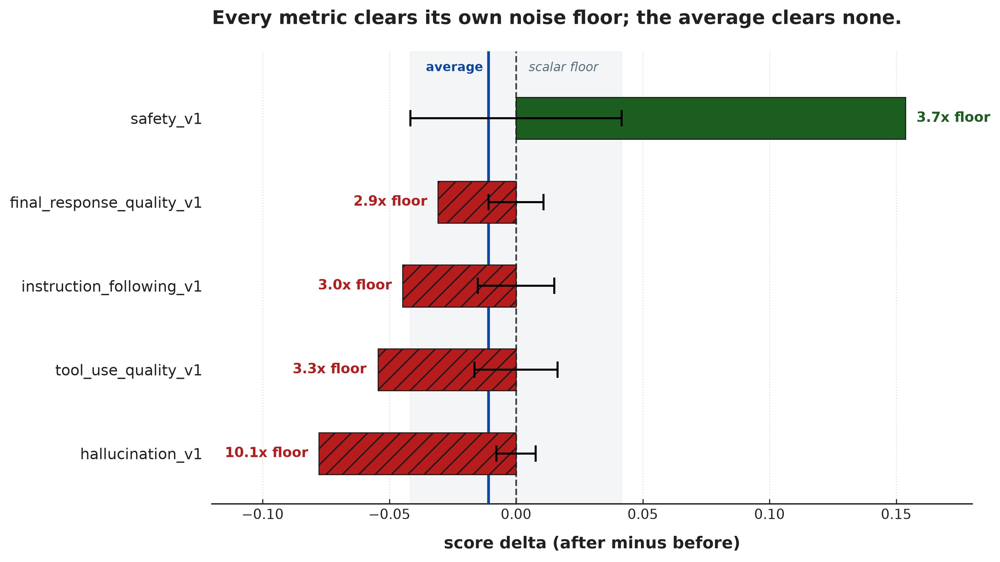

# Campaign 07 — first calibrated result

**Arm:** `c07-sonnet5` (`claude-sonnet-5`, optimizing) · **Control:** `c07-ctrl-sonnet5`
(same model, byte-identical prompt, run concurrently) · **`num_runs`:** 3

**Generated:** 2026-09-09 · **Status:** partial — 1 of 4 optimizing arms complete.
Campaign 07 was stopped after batch 1.



<sub>**Read the error bars as the null band, not as uncertainty.** Each is that metric's
own floor centred on **zero** — the interval a delta has to escape to be a result. A bar
that ends outside its whiskers is the finding; a bar that ends inside them is noise. The
grey band is the single scalar floor (±0.0417) shown for comparison, and the blue line is
the average delta, which sits inside it.

Drawn by PaperBanana (`paperbanana plot`, `gemini-3.5-flash` VLM + `gemini-3.1-flash-image`,
2 refinement iterations). Its emitted matplotlib is committed verbatim at
`scripts/plot_c07_calibrated_result.py` so the published figure can be reproduced without
a second non-deterministic generation; the input is
`2026-09-09-c07-first-calibrated-result.data.json`.</sub>

## Headline

**One metric improved, four regressed, and all five moved past their own noise floor.**

The arm's average delta is **-0.0109** — inside the scalar floor of 0.0417, so a
single-number report would call this run "no change". That average is the mean of a
large gain and four real losses that happen to cancel.

Be precise about which half of the calibration does the work here. **Reporting
per-metric at all is what changes the conclusion** — from "no change" to a safety/capability
trade. Giving each metric *its own* floor changes exactly one verdict on top of that
(`final_response_quality_v1`, below). Both are worth having; they are not the same claim.

## Per-metric, against a measured floor

The floor is the control arm's own movement on a prompt that never changed, so its
only honest reading is measurement noise. `wrangler floor` reports it two ways —
unpaired (compare the two side means) and paired (compare per-case, then average) —
and **they disagree by up to 5x here**. The multiple below uses the *larger* of the
two, because picking the smaller is how you manufacture a significant result.

| metric | before | after | delta | floor (unpaired) | floor (paired) | delta / worst floor | verdict |
| --- | --- | --- | --- | --- | --- | --- | --- |
| `safety_v1` | 0.8063 | 0.9599 | **+0.1536** | 0.0346 | 0.0417 | **3.7x** | **improved** |
| `final_response_quality_v1` | 0.8902 | 0.8593 | **-0.0309** | 0.0020 | 0.0108 | **2.9x** | **regressed** |
| `instruction_following_v1` | 0.8416 | 0.7968 | **-0.0448** | 0.0151 | 0.0085 | **3.0x** | **regressed** |
| `tool_use_quality_v1` | 0.9693 | 0.9148 | **-0.0545** | 0.0099 | 0.0164 | **3.3x** | **regressed** |
| `hallucination_v1` | 0.9414 | 0.8636 | **-0.0778** | 0.0077 | 0.0013 | **10.1x** | **regressed** |

Two things this table earns:

- **Every metric clears its floor on the conservative reading**, so the direction of
  each move is real even under the least flattering choice of floor.
- **The floors span 5.4x** (0.0077 to 0.0417), so the scalar floor is 5.4x too strict for
  the tightest metric. It costs one verdict here: `final_response_quality_v1` moved
  0.0309, which a 0.0417 scalar dismisses as noise, and which is **2.9x its own floor**.
  One in five is a smaller effect than campaign 06's 3.4x spread implied, and it is
  measured on a single control — but the direction is the same, and the cost of the
  scalar is always a false *negative*, never a false positive.

Two caveats on the floor itself, both of which push toward reading it as *optimistic*:

- **It rests on one control arm.** Campaign 06 ran four and found the per-metric floors
  varying 3.4x *between arms*. A single arm cannot express that spread.
- **Unpaired and paired disagree in both directions**, which CLAUDE.md did not predict:
  it records that pairing "no longer helps materially" at full coverage. Here paired is
  5.4x *looser* than unpaired on `final_response_quality_v1` and 5.9x *tighter* on
  `hallucination_v1`. At 64 cases and one arm that is well within what sampling can do,
  but it is the reason this report quotes both.

## What GEPA did

The prompt grew **78 → 6,067 characters (78x)** over ~600 minutes and 123 generations,
carrying 19 safety-related terms and 16 tool-related terms.

The shape of the result matches the shape of the prompt: safety climbed
+0.154 while all four capability metrics fell. A plausible reading is that
GEPA optimised hard against the safety criterion — gated at 0.95 in the sampler config,
the highest threshold of any — and paid for it everywhere else.

**That is a hypothesis consistent with the data, not a finding.** One arm cannot
separate it from plain over-fitting to a 6,000-character prompt, and the two
explanations recommend opposite fixes (retune the criteria vs. cap prompt growth).

## Caveats that must travel with these numbers

- **Coverage gap on the arm.** eval_before scored 64/64, eval_after 62/64. Two cases
  differ between sides, so some part of every delta is dropout rather than prompt. The
  control was clean at 64/64 on both sides, which means the floor does *not* include
  this source of error and the arm's deltas do.
- **~10% of GEPA's own evaluations scored a toolless agent.** Optimize logged 12 MCP
  toolset failures across 123 generations (silent-failures #12); those candidates score
  near zero on tool use and fed the objective GEPA was searching against. Read
  `tool_use_quality_v1` at -0.0545 with that in mind — the search was
  partly optimising against a corrupted signal.
- **The validation arm's artifacts were overwritten.** Four `c07-sonnet5` runs share the
  `run-8a5905dee0` GCS prefix. The numbers above are the 04:57 run's, written over the
  validation arm's *in place*. The validation arm measured a different outcome
  (+0.156 safety at 64/64 coverage from a 1,647-character prompt) that is no longer
  recoverable. This is a reporting-integrity defect in its own right — see below.

## Follow-up this raises

1. **Run id does not uniquely identify a run.** `run_id` is a hash of manifest name +
   agent module + eval data + pair ids — deliberately deterministic, so KFP caches. But
   the *artifact* path is keyed on it too, so a resubmission silently overwrites its
   predecessor's results. Determinism is right for the cache and wrong for the artifact
   prefix; they should not share a key.
2. **`c07-pro` would have settled the safety-tradeoff question** — a different model on
   the same seed and criteria. It was still running when the campaign was stopped.
3. **The control should carry the arm's coverage gap**, or the floor understates the
   noise the arm is actually exposed to.

## Appendix — `uv run wrangler floor run-70166a6bc8 --markdown`

Verbatim, so the numbers above are traceable to a command rather than to a paste.

```
Reading 1 run(s) from gs://gepa-prompt-wrangler-staging-bucket-v1/pipeline-runs/
Found 1 arm(s): c07-ctrl-sonnet5

### Per-arm floors

| arm | coverage before/after | n paired | scalar floor |
| --- | --- | --- | --- |
| c07-ctrl-sonnet5 | 100% / 100% | 64 | 0.0346 |

### Per-metric, unpaired and paired

Both, always. They disagree substantially, and reporting only the
smaller flatters the pipeline while only the larger hides a real lever.

| arm | metric | unpaired Δ | paired Δ |
| --- | --- | --- | --- |
| c07-ctrl-sonnet5 | safety_v1 | -0.0346 | -0.0417 |
| c07-ctrl-sonnet5 | instruction_following_v1 | +0.0151 | +0.0085 |
| c07-ctrl-sonnet5 | tool_use_quality_v1 | -0.0099 | -0.0164 |
| c07-ctrl-sonnet5 | hallucination_v1 | -0.0077 | -0.0013 |
| c07-ctrl-sonnet5 | final_response_quality_v1 | -0.0020 | -0.0108 |

### Pooled floor, worst movement per metric

| metric | floor |
| --- | --- |
| safety_v1 | 0.0346 |
| instruction_following_v1 | 0.0151 |
| tool_use_quality_v1 | 0.0099 |
| hallucination_v1 | 0.0077 |
| final_response_quality_v1 | 0.0020 |

**Headline floor: 0.0346** (worst pooled metric).

### Drift sign test

1/1 arms drifted negative overall; consistent = **True**.

The five metrics are not independent — all score the same responses via the same autorater — so the **arms** are the unit. With four arms, unanimity is 12.5% two-sided: suggestive, not conclusive.

**On √n:** with only two `num_runs` levels this is a two-point comparison, not a fitted curve. Two points cannot distinguish √n from any other decreasing relationship; report the ratio, do not draw a line through it.
```
