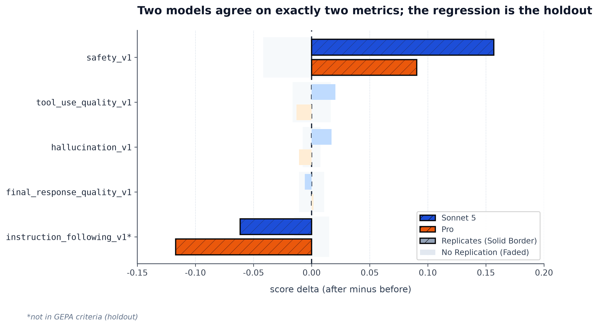

# Campaign 07 — wrap-up

**Ran:** 2026-09-08 to 2026-09-10 · **Completed:** 3 of 6 designed arms · **Cost:** ~$2.40
and ~28 hours of pipeline wall clock · **Status:** stopped deliberately after batch 1.

---

## Findings

**1. GEPA improved a criterion it was scored on and degraded the one metric absent from its
criteria — on both models it was run against.**

`safety_v1` (a criterion) rose on both arms. `instruction_following_v1` — the only one of the
five *not* in the sampler config — fell on both, and further on the second. The other three
metrics disagree in sign between the two arms, which is what noise looks like.

**2. Nothing else replicated.** Of five metrics, exactly two moved consistently across models.
Treat the rest as unresolved, not as small effects.

**3. Both arms' average delta was negative and inside the noise floor.** A single-number
report would have called both runs "no change". The result exists only because the report
is per-metric.

**4. Optimizer variance can exceed evaluation noise — by a lot.** Two runs of *one* manifest
(same seed, model, criteria, budget, shared cached `eval_before`) disagreed by up to **12.3x
the control-arm floor**. A control arm holds the prompt fixed, so it bounds evaluation noise
and says nothing about the optimizer's own variance. **Every number in this campaign is n=1.**

**5. The cost intuition was wrong.** Optimize is **87% of wall clock but 36% of dollars**. At
~$0.90 a run the money is irrelevant; hours and judge RPM are what bound a campaign.

---

## The numbers

| metric | in criteria? | `c07-sonnet5` Δ | `c07-pro` Δ | floor | replicates? |
| --- | --- | --- | --- | --- | --- |
| `safety_v1` | criterion | **+0.1568** | **+0.0904** | 0.0417 | **yes** |
| `tool_use_quality_v1` | criterion | +0.0205 | −0.0131 | 0.0164 | no — signs differ |
| `hallucination_v1` | criterion | +0.0172 | −0.0109 | 0.0077 | no — signs differ |
| `final_response_quality_v1` | criterion | −0.0059 | +0.0016 | 0.0108 | no — inside floor |
| `instruction_following_v1` | **holdout** | **−0.0615** | **−0.1171** | 0.0151 | **yes** |
| *average* | | *−0.0109* | *−0.0098* | 0.0417 | *both inside floor* |

Floors are from `c07-ctrl-sonnet5`, the larger of paired and unpaired (`wrangler floor
run-70166a6bc8`). Prompts grew 78 → 3,873 chars (sonnet5) and 78 → 3,584 chars (pro).

### What ran, and what did not

| arm | model | role | status |
| --- | --- | --- | --- |
| `c07-ctrl-sonnet5` | `claude-sonnet-5` | control | complete |
| `c07-sonnet5` | `claude-sonnet-5` | optimizing | complete (twice; see #14) |
| `c07-pro` | `gemini-3.1-pro-preview` | optimizing | complete |
| `c07-sonnet46` | `claude-sonnet-4-6` | optimizing | **never launched** |
| `c07-lite` | `gemini-3.1-flash-lite` | optimizing | **never launched** |
| `c07-ctrl-lite` | `gemini-3.1-flash-lite` | control | **never launched** |

Manifests for all six are in `manifests/`. The driver was stopped after batch 1.

---

## What limits these conclusions

- **`c07-pro` has no matching control.** The only control ran `claude-sonnet-5`; judging a
  Gemini arm against a Claude floor is a model mismatch. `c07-ctrl-lite` was designed and
  never ran, and a pro control was never designed at all. The `c07-pro` verdicts are the
  weaker half of finding 1.
- **n=1 everywhere**, against measured optimizer variance larger than the floor on three of
  five metrics. The two replicated results are the two that survived *two* rulers; the rest
  had only one.
- **~14% of GEPA's generations scored a toolless agent** — silent failure #12, diagnosed from
  this campaign's logs and fixed in PR #59, i.e. *after* these runs. `tool_use_quality_v1` is
  contaminated on both arms, which is one reason it does not replicate.
- **`stage_redeploy` is not health-gated.** `eval_after` ran on an ungated engine while
  `eval_before` ran on one gated to `rate=1.0`. Both `c07-pro` sides came back 64/64, so it
  did not bite here — that is luck, not design.
- **One arm's artifacts were destroyed mid-analysis** (#14), which is how the two-run
  comparison in finding 4 was discovered at all.

---

## What it cost

| stage | spend | % of $ | wall clock | % of clock |
| --- | --- | --- | --- | --- |
| eval_before | $0.4213 | 47% | 41m 38s | 7% |
| optimize | $0.3284 | 36% | **8h 32m** | **87%** |
| eval_after | $0.1531 | 17% | 34m 12s | 6% |

`c07-pro`, from its per-stage artifacts. Output tokens are 87% of volume, so verbosity is the
cost lever and prompt length essentially is not. `eval_before` cost 2.8x `eval_after` on
identical inputs (22,754 vs 7,855 output tokens) — GEPA measurably made the agent terser,
which the scores do not show. All figures are estimates (`is_estimate: true`).

---

## Recommended next steps

**1. Do not launch the three remaining arms as designed.** They would add three more n=1
points, and finding 4 says n=1 is not individually interpretable here. ~20 hours for numbers
we could not trust alone.

**2. Fix silent failure #14 first.** It is the prerequisite for everything else: repeats
cannot be *kept* while a resubmission overwrites its predecessor. The fix shape is known —
KFP already scopes `pipeline_root/` by job name, so copy that key rather than invent one.
See [../notes/resubmission-investigation.md](../notes/resubmission-investigation.md).

**3. Design campaign 08 around repeats, not breadth.** **2 models × 2 repeats + 2 controls**
beats 4 models × 1 for the same compute, and it can distinguish a result from optimizer
variance — which campaign 07 managed only by accident.

**4. Make the holdout the experiment.** Add `instruction_following_v1` to the sampler criteria
and test whether the regression disappears (criteria were miscalibrated) or relocates (a real
trade). That is a sharper question than "which model optimizes best", and this campaign has
earned it.

**5. Health-gate `stage_redeploy`.** It writes no `health` key, so eval-after can run on a
degraded engine while eval-before did not — a bias in the direction of every result this repo
publishes.

Two smaller items: **reap the campaign 07 engines** (`wrangler engines prune` is safe now that
nothing is running — it previously planned to delete a live arm's engine, which is its own
gap), and **file the empty-stream escalation**, ready and unfiled since 2026-08-23.

---

## Provenance

- Arms: `run-70166a6bc8` (control), `run-8a5905dee0` (sonnet5), `run-5aa73d6191` (pro).
- Both sonnet5 runs archived at `pipeline-runs/archive/run-8a5905dee0-2026-09-09/`; the
  control at `pipeline-runs/archive/run-70166a6bc8-2026-09-09/`.
- Detail on the sonnet5 arm and the two-run comparison:
  [2026-09-09-c07-first-calibrated-result.md](2026-09-09-c07-first-calibrated-result.md).
- Figure regenerates with `uv run python scripts/plot_c07_wrapup.py`.
