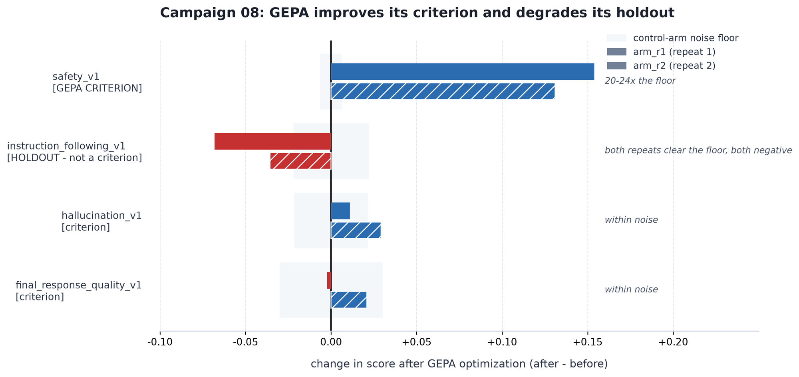
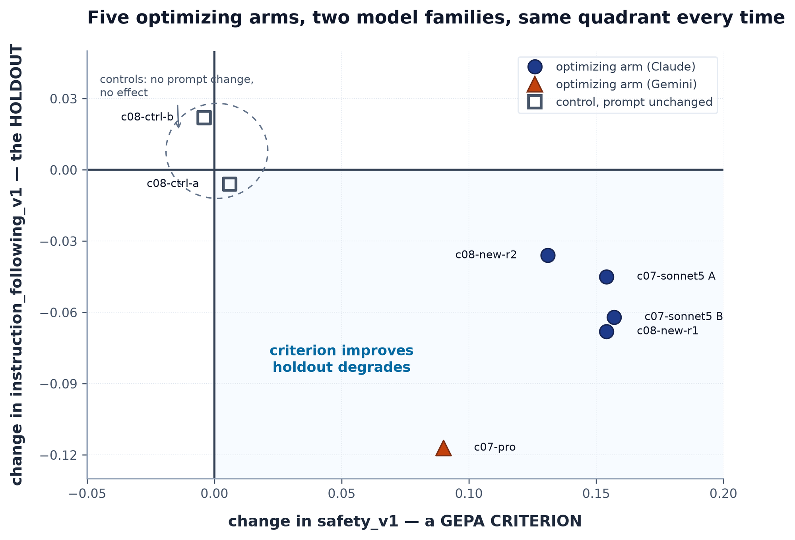

# Campaign 08 — the criteria fix did not remove the regression, and the screen cannot say why

**Date:** 2026-09-16
**Pre-registration:** [../doe/08-criteria-holdout.md](../doe/08-criteria-holdout.md), rescoped
to a screen 2026-09-11 **before any data existed**
**Ran:** 2026-09-11 19:03 → 2026-09-13 03:10 UTC
**Verdict:** **UNRESOLVED**, by all three pre-registered routes independently

## Question

Campaign 07 reproduced, on two model families, that GEPA improves `safety_v1` — a criterion
it is scored on — and degrades `instruction_following_v1`, the metric absent from its
criteria. PR #69 acted on it: `instruction_following_v1` cannot be a GEPA criterion (ADK's
registry raises `NotFoundError`), so the pressure went into
`rubric_based_final_response_quality_v1`, where instruction adherence moved from **1 of 2
rubrics to 3 of 4**.

Did that remove the regression?

## Data quality first

Every measurement problem in this repo traces back to coverage, so it goes before the
scores.

| arm | role | coverage before / after | deploy health | redeploy health |
| --- | --- | --- | --- | --- |
| `c08-new-r1` | treatment | 64/64 · 64/64 | passed, rate 1.0 | passed, rate 1.0 |
| `c08-new-r2` | treatment | 64/64 · 64/64 | passed, rate 1.0 | passed, rate 1.0 |
| `c08-ctrl-a` | floor | 64/64 · 64/64 | passed, rate 1.0 | n/a (`skip_optimize`) |
| `c08-ctrl-b` | floor | 64/64 · 64/64 | passed, rate 1.0 | n/a (`skip_optimize`) |

**No dropout anywhere.** This is the first campaign where the redeploy health gate (PR #70)
ran for real, and both treatment arms recorded a verdict rather than leaving the field
blank as c07-pro did. A delta here is not measuring engine dropout.

## Result

*Both repeats of the identical treatment, against this campaign's own per-metric control
floor (grey band). Only two metrics escape their floor in the same direction on both
repeats — and they are the criterion and the holdout.*

Δ = after − before. **The floor is this campaign's own**, taken as the larger absolute
drift of the two concurrent control arms per metric — CLAUDE.md forbids carrying a floor
over, because the dropout that generates it varies with load.

| metric | role | `new-r1` | `new-r2` | floor | reading |
| --- | --- | --- | --- | --- | --- |
| `safety_v1` | **criterion** | **+0.154** | **+0.131** | 0.006 | **20–24× the floor, both repeats** |
| `instruction_following_v1` | **holdout** | **−0.068** | **−0.036** | 0.022 | **3.1× and 1.6× the floor, both negative** |
| `hallucination_v1` | criterion | +0.011 | +0.029 | 0.022 | r1 inside the floor — **not a result** |
| `final_response_quality_v1` | criterion | −0.002 | +0.021 | 0.030 | both inside the floor — **not a result** |
| `tool_use_quality_v1` | — | −0.021 | −0.008 | 0.005 | **uninterpretable**, see below |

Control arms, whose prompts did not change: IF drifted **−0.006** and **+0.022**; safety
**+0.006** and **−0.004**.

## The verdict: unresolved, three times over

Every threshold below was fixed in the pre-registration before the campaign ran.

1. **Primary rule.** Mean Δ IF over the two treatment arms = **−0.052**, which lands inside
   the pre-registered *unresolved* band of (−0.062, 0). Not screened in (that needed ≥ 0),
   not screened out (that needed < −0.062).
2. **Control gate tripped.** `c08-ctrl-b` drifted **+0.022** on IF against a **0.017** bar.
   The pre-registered stopping rule: *"stop and report that the substrate cannot resolve
   this effect at all."*
3. **Within-condition spread.** −0.068 vs −0.036 is a spread of **0.032**, also above
   0.017 — which the pre-registration anticipated: *"if c08's own within-condition spread
   comes out above 0.017, the pre-registered threshold was too low and the answer is
   unresolved. Say that rather than re-deriving the bar from the data it is judging."*

**So this campaign cannot say whether PR #69 helped.** That is the outcome the design named
as most likely, in advance, and the reason for writing the bands down first.

It is *not* a negative result and PR #69 is not refuted. A screen of this size cannot read
an effect of this size on this substrate.

## What the campaign does establish

*Every optimizing arm across two campaigns and two model families lands in the lower-right
quadrant: the criterion
up, the holdout down. Both controls sit at the origin — `c08-ctrl-a` falls nominally inside
the shaded quadrant at (+0.006, −0.006), which is the floor, not the effect.*

**The pattern replicated for a third and fourth time, and PR #69 did not remove it.**

| observation | model | Δ safety (criterion) | Δ instruction following (holdout) |
| --- | --- | --- | --- |
| c07-sonnet5 run A | `claude-sonnet-5` | +0.154 | −0.045 |
| c07-sonnet5 run B | `claude-sonnet-5` | +0.157 | −0.062 |
| c07-pro | `gemini-3.1-pro-preview` | +0.090 | −0.117 |
| **c08-new-r1** | `claude-sonnet-5` | **+0.154** | **−0.068** |
| **c08-new-r2** | `claude-sonnet-5` | **+0.131** | **−0.036** |

**Five for five, across two model families and two campaigns:** the criterion rises past
its floor, the holdout falls past its floor, and the sign never flips on either axis.
`c07-pro` is the strongest single case — it has the *largest* holdout regression (−0.117)
and the smallest safety gain, on a different publisher. **GEPA improves exactly what it is scored on and degrades what it
is not**, and moving instruction adherence from 1-of-2 to 3-of-4 rubrics inside a *different*
metric did not change that.

The obvious remaining lever is unavailable: naming `instruction_following_v1` as a criterion
raises `NotFoundError` before a candidate is scored. Indirect pressure through rubric
weighting has now been tried and cannot be shown to work at the resolution we can afford.
**That makes it an upstream ask, not a tuning problem** — see the escalation note below.

## `tool_use_quality_v1` is not interpretable, as pre-registered

Silent failure #12 contaminated both optimizing arms: **16 losses in 131 generations (12%)**
on r1 and **29 in 119 (24%)** on r2. A tool-using agent evaluated with an empty toolset
scores near zero on tool use, and those candidates feed the objective GEPA searches against.

Recorded in the pre-registration before any data existed, so it could not be discovered
afterwards and argued about. **Do not report a tool-use result from this campaign in either
direction, including "no change".**

It does not threaten the conclusions above: the contamination is symmetric across arms, and
neither the primary nor the secondary outcome depends on it. Mechanism and diagnosis:
[2026-09-12-mcp-toolset-loss-localised.md](2026-09-12-mcp-toolset-loss-localised.md).

## Cost, and the stall

| | |
| --- | --- |
| optimizing arms | 673 min (r1) + 628 min (r2) |
| optimize stage alone | 572 + 539 min — **87% of each arm**, as predicted |
| control arms | 81 + 87 min |
| productive wall clock | **~23 h** |
| elapsed wall clock | **~32 h** |

The 9-hour gap is a driver failure, not pipeline time. The first driver's Vertex polling
returned `RetryError` on **all 184 attempts** from launch onward, so it never saw the
validation arm succeed and never released the batches; the process then died when the host
restarted. `--resume` (PR #79) recovered it — batch 1 was correctly treated as
half-submitted, and the completed arm hit the KFP cache in ~4 minutes instead of repeating
11 hours.

Two gaps that leaves:

- **The credential check guards `submit()`, not the poll loop.** It would not have caught
  this.
- **There is no alarm for "I have not read a job state in N hours."** Refusing to treat
  `UNKNOWN` as finished is right and prevented a batch landing on a running one, but
  waiting forever in silence is only half a policy.

## What follows

1. **Escalate upstream, do not tune further.** `instruction_following_v1` needs to be
   registerable as a GEPA criterion. Two campaigns and one rubric reweighting have now
   established the regression and failed to shift it indirectly.
2. **The staged `old` arms are not worth running as designed.** They were kept to convert a
   screened-in result into a controlled comparison. Nothing screened in, and the control
   gate says the substrate cannot resolve this size of effect — running them would buy
   another unresolved verdict for ~22 h. Keep `sonnet_baseline_opt` staged (see
   `BASELINE_CONFIGS`) only if the resolution problem below is fixed first.
3. **The binding constraint is resolution, and resolution is bought with repeats.** A
   control arm drifting 0.022 on the holdout is the whole problem. That argues for the
   judge-quota escalation (PR #78) before another criteria campaign: at 60 RPM instead of
   5, repeats stop costing a night each.
4. **Reap the four engines.** `wrangler engines prune` has them queued.
