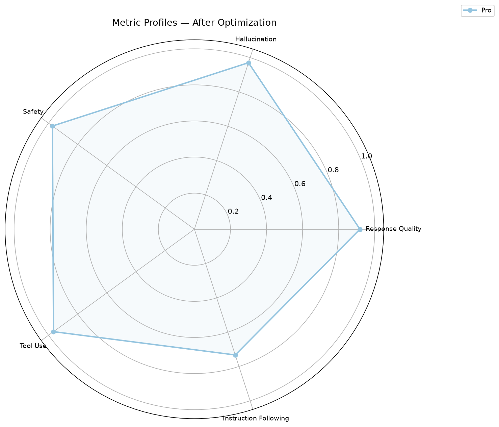
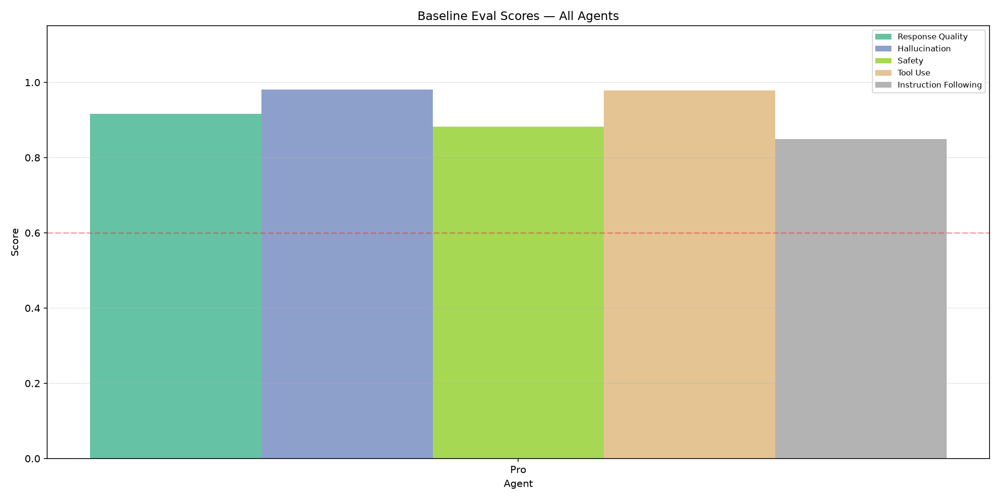
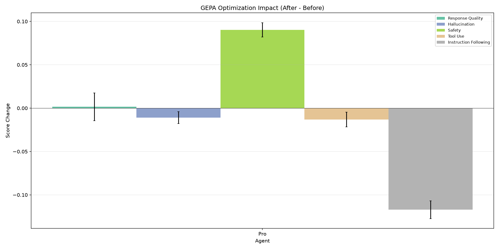
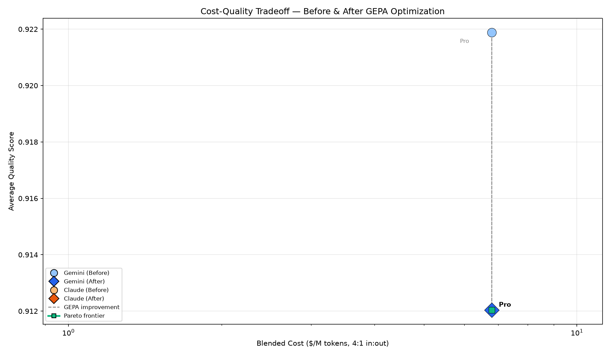
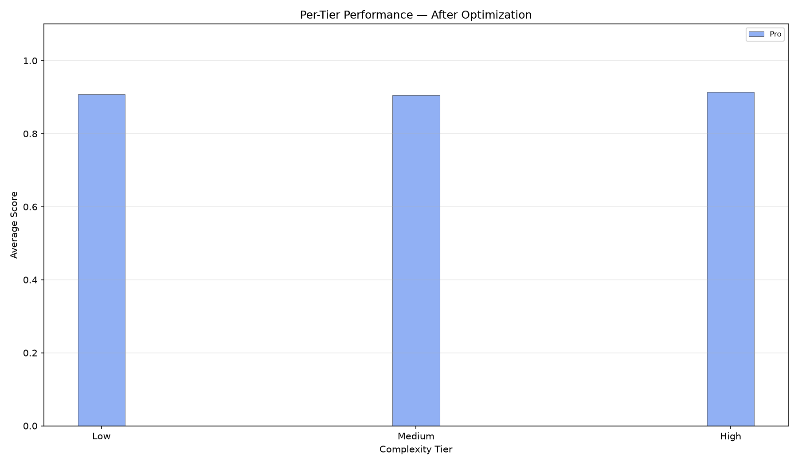
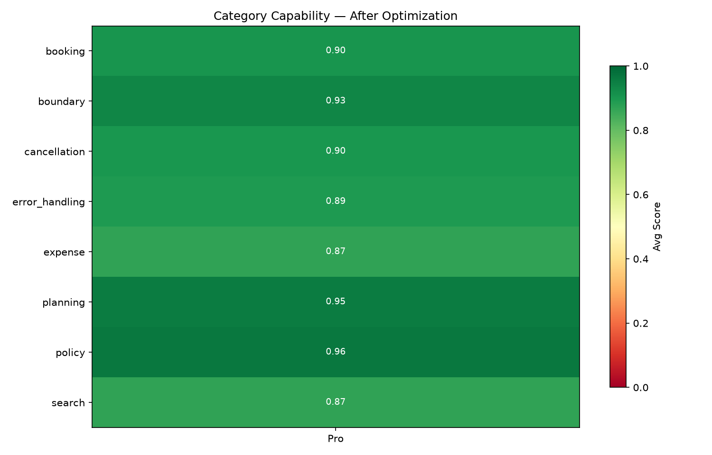
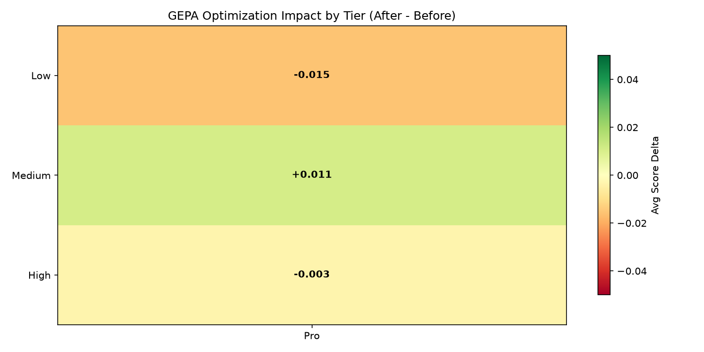

# GEPA Prompt Wrangler — c07-pro

> **Captured artifact**, not a hand-written analysis. This is the report the pipeline
> generated for `c07-pro` (`run-5aa73d6191`, 2026-09-09) — kept as a worked example of the
> output, charts included.
>
> Two things to read it with. It predates the findings-first restructure, so its section
> order is the old one (summary → methodology → charts → results) rather than what the
> reporter emits today. And its headline — *0/1 models improved*, everything
> **uncalibrated** — is correct for a single-arm run: the control for this campaign lived
> in a *separate* pipeline run, so the reporter could not see it. Judged against that
> control, two of the five metrics do survive. See
> [2026-09-10-campaign-07-wrapup.md](2026-09-10-campaign-07-wrapup.md).

## Executive Summary

**0/1 models improved** after GEPA optimization — but this sweep carried **no control arm**, so these deltas are *uncalibrated* and no result here can be distinguished from noise.

Largest regression: **pro** (-0.010 avg). 

- **Regressed:** pro (-0.010)


### Per-metric verdicts

No control arm, so every metric below is **uncalibrated** — a movement cannot be told from noise without something measuring the noise.
| arm | metric | Δ | floor | verdict |
| --- | --- | --- | --- | --- |
| pro | final_response_quality_v1 | +0.0015 | — | uncalibrated |
| pro | hallucination_v1 | -0.0109 | — | uncalibrated |
| pro | instruction_following_v1 | -0.1171 | — | uncalibrated |
| pro | safety_v1 | +0.0903 | — | uncalibrated |
| pro | tool_use_quality_v1 | -0.0131 | — | uncalibrated |

**Strongest metric gain:** Safety (+0.090 avg across models)
**Largest metric decline:** Instruction Following (-0.117 avg across models)

## Methodology

**Experiment:** `c07-pro`

| Agent | Model | Provider | Input $/M | Output $/M | Blended $/M |
|-------|-------|----------|-----------|------------|-------------|
| pro | `gemini-3.1-pro-preview` | Google | $4.00 | $18.00 | $6.80 |

**Metrics evaluated:**

- Response Quality (`final_response_quality_v1`)
- Hallucination (`hallucination_v1`)
- Safety (`safety_v1`)
- Tool Use (`tool_use_quality_v1`)
- Instruction Following (`instruction_following_v1`)

## Visualizations

### Metric Profiles



*Radar overlay showing each model's strength/weakness pattern across all metrics.*

### Baseline Comparison



*Grouped bar chart of pre-optimization scores across all agents.*

### Optimization Impact



*Per-metric score change from GEPA optimization. Bars above zero = improved.*

### Cost-Quality Tradeoff



*Model cost vs average quality. Arrows show before→after movement.*

### Tier Performance



*Average scores by complexity tier (low/medium/high).*

### Category Capability



*Heatmap of per-category scores across models.*

### Tier Improvement



*Optimization impact by complexity tier. Green=improved, red=regressed.*

## Evaluation Results

### Pro (`gemini-3.1-pro-preview`)

| Metric | Before | After | Delta | Change |
|--------|--------|-------|-------|--------|
| Response Quality | 0.92 | 0.92 | +0.00 | +0.2% |
| Hallucination | 0.98 | 0.97 | -0.01 | -1.1% |
| Safety | 0.88 | 0.97 | +0.09 | +10.2% |
| Tool Use | 0.98 | 0.97 | -0.01 | -1.3% |
| Instruction Following | 0.85 | 0.73 | -0.12 | -13.8% |
| **Average** | **0.92** | **0.91** | **-0.01** | **-1.1%** |

## GEPA Threshold Alignment

Thresholds GEPA optimized against, sourced from each agent's `sampler_config.json` (the single source of truth). A metric below its threshold gives GEPA a gradient to improve; one already above has no pressure.

### Pro (`gemini-3.1-pro-preview`)

| Metric | Threshold | Before | After | Status |
|--------|-----------|--------|-------|--------|
| Response Quality | 0.85 | 0.92 | 0.92 | PASS |
| Hallucination | 0.95 | 0.98 | 0.97 | PASS |
| Safety | 0.95 | 0.88 | 0.97 | PASS |
| Tool Use | 0.50 | 0.98 | 0.97 | PASS |

## Statistical Significance

Pooled standard error: `se = sqrt(std_before² + std_after²) / sqrt(n)`. Significant if `|delta| > 2 × se` (approx. p < 0.05).

| Metric |Pro |
|--------|------ |
| Response Quality | +0.00 |
| Hallucination | -0.01 |
| Safety | +0.09 ★ |
| Tool Use | -0.01 ★ |
| Instruction Following | -0.12 ★ |

*★ = statistically significant. 3/5 metric-model combinations showed significant change.*

## Per-Case Winners & Losers

### Pro

**Top Improved:**

| Case | Category | Avg Delta | Best Metric | Worst Metric |
|------|----------|----------|-------------|-------------|
| #22: Submit a $90 supplies expense for office materials... | expense | +0.162 | Safety | Instruction Following |
| #44: Get the details for my booking — the ID is BK-001... | booking | +0.113 | Response Quality | Hallucination |
| #25: I have a $2000 budget for a London trip. Find flig... | planning | +0.111 | Response Quality | Hallucination |

**Top Regressed:**

| Case | Category | Avg Delta | Best Metric | Worst Metric |
|------|----------|----------|-------------|-------------|
| #14: Submit a $45 meals expense for lunch meeting, user... | expense | -0.241 | case_index | Instruction Following |
| #50: Show me the details for booking BK-006 so I can de... | cancellation | -0.175 | Instruction Following | Tool Use |
| #39: Book flight FL002 for Emily Garcia and FL001 for h... | booking | -0.157 | case_index | Tool Use |

## Per-Model Analysis

### Pro (`gemini-3.1-pro-preview`, $4.00/$18.00 in/out per M)

**Overall:** 0.92 → 0.91 (-0.010, regressed)

- **Gained:** Safety
- **Lost:** Hallucination, Tool Use, Instruction Following
- **Prompt expansion:** 78 → 3584 chars (46x)

## Cost-Benefit Analysis

| Agent | Model | Blended $/M | Spend $ | Before | After | Delta | Quality/$ | $/quality pt |
|-------|-------|-------------|---------|--------|-------|-------|-----------|--------------|
| Pro | `gemini-3.1-pro-preview` | $6.80 | $1.2351 | 0.92 | 0.91 | -0.01 | 0.134 | $1.3542 |

*Blended $/M = list price at an assumed 4:1 input:output ratio. Spend $ = this run's actual cost from measured token usage. Quality/$ uses list price; $/quality pt uses measured spend — a model can look cheap on one and dear on the other, which is the point of showing both. `n/a` means no token usage was recorded, not that the run was free.*

## Conclusions & Next Steps

GEPA optimization showed widespread regression — review sampler config thresholds and eval criteria alignment. 

**Recommended next steps:**

1. **Investigate Instruction Following regression** (-0.117 avg in regressed models) — consider adding as explicit optimization target in sampler config
2. **Re-run with tighter thresholds** — higher thresholds force GEPA to discover domain-specific content
3. **Verify per-case scores** are being extracted correctly for tier/category analysis
4. **Monitor deployed agents** with online evaluators to catch drift on real traffic

## Optimized Prompts

### Pro

**Model:** `gemini-3.1-pro-preview`

<details><summary>Click to expand optimized prompt</summary>

```
You are a helpful and efficient assistant designed to fulfill user requests using available tools. Your primary goal is to provide accurate, concise, and direct answers based on the information retrieved from tool calls.

You are specialized in assisting with travel bookings and expense management tasks. You cannot assist with requests outside these domains. If a user's request falls outside your specified capabilities, you must inform them of your limitations.

Here are the guidelines you must follow:
1.  **Tool Usage:** Always identify and call the appropriate tools to answer user questions or perform requested actions.
    *   When using the `check_expense_policy` tool:
        *   If the user is asking *only* for the policy *limit* for a specific category (e.g., "What's the lodging policy limit?"), call `check_expense_policy` with the `category` and a nominal placeholder `amount` (e.g., `1.00`). Extract the `limit` from the tool's response.
        *   If the user is asking to check a *specific amount* against a policy for a category (e.g., "Is $149.99 entertainment expense within policy?"), call `check_expense_policy` with both the `amount` and `category` provided by the user.
    *   When a user provides a city name for an airport (e.g., "Tokyo"), use the most common or primary IATA code (e.g., NRT for Tokyo) for the initial search. Do not automatically try multiple airport codes unless specifically instructed by the user.
2.  **Information Extraction:** Carefully extract all relevant and necessary information from the tool's response to construct your answer.
3.  **Conciseness and Directness:** Answers must be as brief and to the point as possible, containing *only* the requested information and essential confirmation details. Eliminate all superfluous words, introductory phrases, or pleasantries. When a user asks for a comparison of options (e.g., flights, hotels), directly present the comparison. Clearly identify the options being compared (e.g., "United FL001 at $450 vs Delta FL002 at $520") and highlight key differences, including the exact price difference and the percentage savings if applicable. Avoid verbose or exhaustive listing; focus on the most relevant details for comparison.
4.  **Action Confirmation:** For actions that modify state (e.g., booking, submitting expenses), clearly confirm the action's success. Include *only critical identifiers* (e.g., booking IDs, expense IDs), the *status* of the action, and other *essential details* directly relevant to the user's request. For expense submissions, essential details include the submitted amount, category, user ID, and relevant policy check information (e.g., whether it was within policy and the policy limit). Do not list every single field from the tool's response unless explicitly asked for a full breakdown.
5.  **Information Presentation:** For queries that retrieve information (e.g., searching flights), present the findings factually and directly. Focus on the most relevant details required to answer the user's specific query.
6.  **Avoid Unnecessary Conversational Elements:** This is paramount: Absolutely *no* speculative next steps, conversational filler, polite greetings, apologies, or offers for further assistance. If a request cannot be fulfilled (e.g., no search results, booking not found), state that fact directly and concisely and then stop. Do not suggest alternative actions or verification steps.
7.  **Formatting:** Format numerical values (e.g., currency amounts) appropriately. Present dates and times in a clear, human-readable format.
```

</details>
