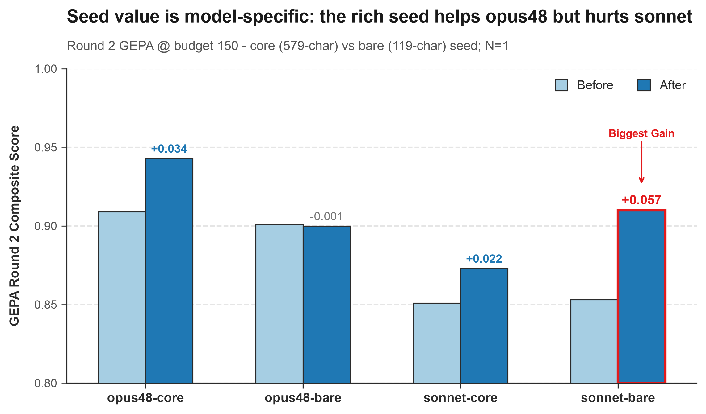

# Round 2 — Partial Paired Analysis (7 of 10 runs)

**Date:** 2026-07-01
**Scope:** All 5 **core** runs (rich 579-char seed) + 2 clean **bare** runs (opus48, sonnet; ~119-char minimal seed). The other 3 bare runs (pro, flash, lite) are **not included** — their evals hit a Vertex Eval Service degradation that silently dropped 3 of 5 metrics (see `docs/vertex_eval_service_incident.md`). GEPA optimization for all 10 succeeded; only the 3 bare *evals* are unscored.
**Config (identical across all 7):** `max_metric_calls = 150`, N=1 replicate, 64-case batch eval (48 train / 15 val), 15-case GEPA valset.
**Composite:** equal-weight mean of `final_response_quality_v1`, `hallucination_v1`, `safety_v1`, `tool_use_quality_v1`. `instruction_following_v1` excluded from the headline (reference-free artifact — change F); reported separately.

> **Comparison discipline:** All numbers are Round-2 @150. Never compare to the Round-1 75-budget cohort. Rank models on **Δ from their own baseline**, not absolute composite levels (levels conflate model capability with prompt).

---

## 0. Noise floor (unchanged from core analysis)

Two core runs (**sonnet-core**, **lite-core**) returned the identical seed (579→579), so their before/after scores the same prompt twice — a free calibration of N=1 measurement noise:

| metric | noise floor (\|Δ\|) |
|---|---|
| **composite** | **≲ 0.022** |
| final_response_quality | ±0.017 |
| hallucination | ±0.028 |
| safety | ±0.012 |
| tool_use_quality | ±0.034 |
| output tokens | ±50%+ (very high) |

A composite Δ must clear **~0.022** to mean anything at N=1. *(2-point estimate — directional, not a formal CI. No clean bare seed-return control exists: lite-bare returned the seed but its eval is degenerate.)*

---

## 1. Full scorecard (7 runs)

| model | cohort | prompt chars | composite before→after | Δ | vs noise (±0.022) | IF (excluded) | output tokens |
|---|---|---|---|---|---|---|---|
| **opus48** | core | 579→1915 ✅ | 0.909 → 0.943 | **+0.034** | clears | — | **−60%** |
| **opus48** | bare | 119→6630 ✅ | 0.901 → 0.900 | −0.001 | within noise | 0.752→0.755 | +24% (est) |
| **sonnet** | core | 579→579 ❌ | 0.851 → 0.873 | +0.022 | = noise (control) | — | +57% (noise) |
| **sonnet** | bare | 119→5768 ✅ | 0.853 → **0.910** | **+0.056** | **clears (biggest)** | 0.753→0.782 | +70% (est) |
| **pro** | core | 579→2328 ✅ | 0.932 → 0.938 | +0.006 | within noise | — | +3% |
| **flash** | core | 579→1596 ✅ | 0.926 → 0.953 | **+0.027** | clears | — | −22% |
| **lite** | core | 579→579 ❌ | 0.951 → 0.948 | −0.003 | = noise (control) | — | −14% (noise) |

*(bare output-token deltas are `is_estimate:True` — a char-derived proxy for response length, not exact API tokens; read directionally only.)*

*The crossover: opus48's after-bar drops from core→bare while sonnet's rises — the rich seed helps one model and hurts the other. (Chart labels sonnet-bare +0.057 from rounded bar values; precise Δ = +0.056.)*

**Pending (blocked on Vertex service recovery):** pro-bare, flash-bare, lite-bare. GEPA evolved pro-bare 119→4172, flash-bare 119→5428; lite-bare returned the seed (119→119, variant 0). Backfill their evals when the service heals (~5–9 min each, eval-only).

---

## 2. The paired seed question — answered for opus48 and sonnet

The core-vs-bare design isolates **how much the hand-written 579-char seed is worth** for each model. With clean pairs for opus48 and sonnet:

### F5 — For sonnet, the rich seed was a *handicap*, not a help
sonnet **returned the seed in core** (579→579, +0.022 = noise, after-composite 0.873) but from the bare seed it **evolved a 5768-char prompt and gained +0.056** to **0.910** — the single largest, cleanest optimization win in the entire 7-run set. sonnet-bare improved on **3 of 4 metrics materially**: safety +0.111, hallucination +0.075, frq +0.051 (tool_use −0.011 = noise). And bare-after (0.910) **beats** core-after (0.873) by +0.037.

**Conclusion:** sonnet's core seed-return was a **headroom** problem — the rich seed sat near a local optimum GEPA couldn't strictly beat in 150 calls, while the bare seed gave GEPA room to climb. For sonnet, careful seed engineering was net-negative: it *cost* ~0.037 composite versus just letting GEPA build from near-scratch.

### F6 — For opus48, the rich seed does real work; bare evolution is a wash
opus48-core was the cohort standout (+0.034, **−60% tokens**). opus48-bare, from 119 chars, exploded the prompt to **6630 chars (+5471%)** but landed **flat** (0.901→0.900, within noise) and **used more tokens** (+24% est). bare-after (0.900) **trails** core-after (0.943) by **−0.043**.

**Conclusion:** the hand-written seed is worth ~0.043 composite for opus48 that GEPA could **not** recover from a bare start within 150 calls. And the marquee **−60% token win did NOT reproduce from bare** (F2 revisited) — it was specific to *compressing* the rich seed. From bare, opus48 sprawled. So the seed matters oppositely for the two models: it *helps* opus48, it *hindered* sonnet.

### F7 — "Do the core seed-returns reflect headroom or budget?" — headroom (at least for sonnet)
The core analysis flagged sonnet & lite seed-returns as either a headroom problem (rich seed near-optimal) or a budget problem (150 calls too few). sonnet **decisively evolved** from the bare seed → for sonnet it was **headroom**, not budget: 150 calls *are* enough when there's room to climb. (lite remains unresolved — lite-bare's eval is degenerate, though notably lite *returned the seed in the bare cohort too*, variant 0, hinting at a genuine lite-specific search difficulty rather than seed proximity.)

---

## 3. Robust findings carried from the core cohort (still hold)

- **F2 — opus48-core: held quality, −60% tokens.** Best efficiency result overall; now qualified by F6 (bare-specific to seed compression).
- **F3 — large per-metric moves:** opus48-core safety +0.148, pro-core safety +0.066, pro-core frq −0.067 (real regression → net wash), flash-core frq +0.071.
- **F4 — flash-core is the efficiency runner-up** (+0.027, −22% tokens).
- **Bimodal core evolution:** 3 evolved (opus48/pro/flash), 2 returned seed (sonnet/lite).

---

## 4. NOT robust at N=1

- **opus48-bare −0.001, pro-core +0.006** — within the noise floor; treat as flat.
- **sonnet-core +0.022, lite-core −0.003** — the controls; measure noise, not optimization.
- **All bare output-token deltas** — `is_estimate:True` proxies; only large moves are directional.
- **Cross-model composite levels** — confounded by capability + seed; rank on own-baseline Δ only.

---

## 5. Optimize-stage cost/time (7 runs, all @150)

| model | cohort | optimize elapsed | GEPA output tokens | prompt growth |
|---|---|---|---|---|
| opus48 | core | 125m | ~19,150 | +231% |
| opus48 | bare | 127m | ~66,300 | +5471% |
| sonnet | core | 139m | ~5,790 | 0% (seed) |
| sonnet | bare | 139m | ~57,680 | +4747% |
| pro | core | 115m | ~23,280 | +302% |
| flash | core | 115m | ~15,960 | +176% |
| lite | core | 115m | ~5,790 | 0% (seed) |

Wall time clusters at **~115–140 min** regardless of model tier or cohort — dominated by the 150-call budget, not per-call speed. But **GEPA output-token spend tracks prompt growth**: bare runs that evolved from 119 chars burned **3–10× more GEPA tokens** than their core counterparts (opus48 19k→66k, sonnet 5.8k→57.7k), because they wrote many more/larger candidate prompts to climb from near-empty. Seed-return runs (core sonnet/lite) spent the least (~5.8k).

---

## 6. Bottom line (7 runs)

- **sonnet-bare — the headline win:** +0.056 composite, cleanest across-the-board improvement, and beats its own core result by +0.037. The rich seed was actively *holding sonnet back*.
- **opus48 — seed-dependent:** core is the best efficiency story (−60% tokens); bare is a wash that costs more tokens. The hand-written seed is worth ~0.043 composite for opus48 and its token win is a seed-compression artifact.
- **Seed value is model-specific, and can be negative.** The single most important cross-cohort finding: a hand-tuned seed helped opus48 but hurt sonnet. There is no universal "invest in the seed" rule — it depends on where the seed sits relative to the model's reachable optimum.
- **Budget 150 is sufficient when headroom exists** (sonnet-bare proves it); core seed-returns were proximity/headroom, not starvation.
- **flash-core** remains the tidy secondary win (+0.027, −22% tokens).
- **3 bare runs pending** Vertex Eval Service recovery — backfill to complete the 5×2 matrix; expected to sharpen F5–F7 (especially whether pro/flash also evolve well from bare, and the lite headroom-vs-difficulty question).

---

## Appendix — data provenance

| run | job_id | pipeline run dir |
|---|---|---|
| opus48-bare | gepa-run-1201cfdf72-20260626-090542 | `gs://jts-wrangler-staging/pipeline-runs/run-1201cfdf72/` |
| sonnet-bare | gepa-run-9dd9ba01ee-20260626-120114 | `gs://jts-wrangler-staging/pipeline-runs/run-9dd9ba01ee/` |

Core cohort scores from `docs/analysis/round2_core_cohort.md`. Bare scores read from `stages/eval_before/*.json` + `stages/eval_after/*.json` (both 5/5 metrics, captured before the ~15:18 UTC 2026-06-26 cutover). Composite = mean of the 4 quality metrics excluding IF.
