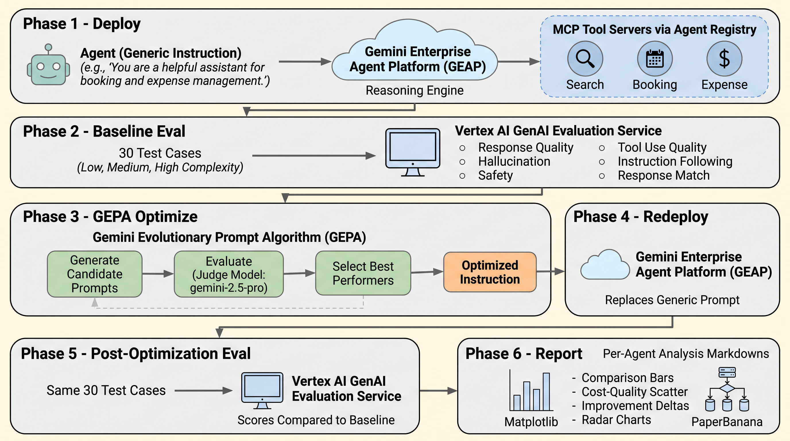
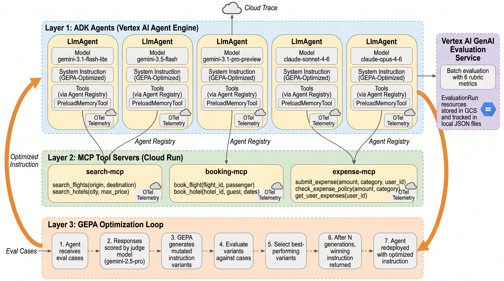

# Multi-Model Agent Comparison Example

End-to-end example comparing 5 model tiers on the same corporate travel/expense agent.

## Pipeline Overview



## Architecture



## Models Tested

| Tier | Model | Provider | Input $/M | Output $/M |
|------|-------|----------|----------|-----------|
| 1 | gemini-3.1-flash-lite | Google | $0.25 | $1.50 |
| 2 | gemini-3.5-flash | Google | $1.50 | $1.65 |
| 3 | gemini-3.1-pro-preview | Google | $4.00 | $18.00 |
| 4 | claude-sonnet-4-6 | Anthropic | $3.00 | $15.00 |
| 5 | claude-opus-4-6 | Anthropic | $5.00 | $25.00 |

*Source: [GEAP Model Pricing](https://cloud.google.com/gemini-enterprise-agent-platform/generative-ai/pricing)*

## What's Included

```
multi_model_agents/
├── manifest.yaml              # 5-pair experiment config
├── deploy_agents.py           # Deploy script for all agents
├── .env.example               # Environment template
├── config.py                  # Shared GCP config (resolve_model, etc.)
├── registry.py                # Agent Registry MCP tool discovery
├── agents/                    # Standalone ADK agents (one per model tier)
│   ├── lite_agent.py
│   ├── flash_agent.py
│   ├── pro_agent.py
│   ├── sonnet_agent.py
│   └── opus_agent.py
├── mcp_servers/               # MCP tool servers (Cloud Run)
│   ├── search/                # Flight + hotel search
│   ├── booking/               # Flight + hotel booking
│   └── expense/               # Expense management
├── eval_data/                 # Eval cases (30 cases across 3 complexity tiers)
│   ├── eval_cases.yaml
│   ├── agent_eval_configs.py
│   └── tier_eval_cases.py
└── scripts/
    ├── deploy_mcp_servers.sh  # Deploy MCP servers to Cloud Run
    ├── deploy_agents.py       # Deploy agents to Agent Engine
    ├── deploy_all.sh          # Full infrastructure deployment
    ├── setup_apphub.sh        # App Hub topology registration
    ├── setup_logging_sink.sh  # BigQuery logging sink for eval history
    └── setup_monitoring.sh    # Full monitoring stack (sink + evaluators + verify)
```

## Quick Start

### Step 0: Configure Environment

```bash
cd examples/multi_model_agents
cp .env.example .env
# Edit .env with your GCP project ID, region, and project number
```

### Step 1: Deploy MCP Tool Servers

Deploys 3 Cloud Run services with `wrangler-` prefix and OTel instrumentation:

```bash
bash scripts/deploy_mcp_servers.sh
```

This creates:
- `wrangler-search-mcp` — flight + hotel search tools
- `wrangler-booking-mcp` — flight + hotel booking tools
- `wrangler-expense-mcp` — expense submission, policy checks, history

The script auto-updates `.env` with the deployed service URLs.

### Step 2: Register MCP Servers in Agent Registry

Register each MCP server so deployed agents can discover tools by resource name:

```bash
bash scripts/register_agent_registry.sh
```

This:
- Registers each server with its tool specs in Agent Registry
- Looks up the assigned resource names
- Auto-updates `.env` with `SEARCH_MCP_SERVER`, `BOOKING_MCP_SERVER`, `EXPENSE_MCP_SERVER`

### Step 3: Create Staging Bucket (if needed)

The deploy script creates the staging bucket automatically. If you need to create it manually:

```bash
gsutil mb -p $GCP_PROJECT_ID -l $GCP_REGION gs://$GCP_STAGING_BUCKET
```

### Step 4: Deploy All 5 Agents

Deploy all agents to Vertex AI Agent Engine:

```bash
# From the repo root
uv run python examples/multi_model_agents/deploy_agents.py
```

Or deploy specific agents:

```bash
uv run python examples/multi_model_agents/deploy_agents.py lite flash
uv run python examples/multi_model_agents/deploy_agents.py pro sonnet opus
```

Each agent is deployed with:
- `wrangler-{name}-agent` display name
- GEPA-optimized instructions
- OTel telemetry enabled
- Engine ID auto-written to `.env`

### Step 4: Setup Monitoring (Optional)

One command sets up the full monitoring stack:

```bash
bash scripts/setup_monitoring.sh
```

This creates:
1. **BigQuery logging sink** — routes agent traces to `gepa_wrangler_logs` for SQL-queryable eval history
2. **Online evaluators** — automatically score OTel traces every 10 min for all deployed agents
3. **Verification** — confirms evaluators are ACTIVE
4. **Health check** — runs a quick 3-case monitor against the first agent

Skip the logging sink if already set up:
```bash
bash scripts/setup_monitoring.sh --skip-sink
```

Or run individual components:
```bash
# Logging sink only
bash scripts/setup_logging_sink.sh

# Online evaluators only (from repo root)
uv run python -m wrangler.online_evaluators create

# Verify evaluators
uv run python -m wrangler.online_evaluators verify

# On-demand health check
uv run python -m wrangler.online_monitors $LITE_ENGINE_ID
```

Query eval results in BigQuery:
```sql
SELECT * FROM `hybrid-vertex.gepa_wrangler_logs.online_eval_results`
WHERE timestamp > TIMESTAMP_SUB(CURRENT_TIMESTAMP(), INTERVAL 24 HOUR)
```

Verify they're active:
```bash
uv run python -m wrangler.online_evaluators verify
```

See [docs/online_eval_guide.md](../../docs/online_eval_guide.md) for details on evaluators vs monitors.

### Step 5: Register in App Hub (Optional)

Register wrangler agents and MCP servers in App Hub to populate the **Topology tab** in the Agent Engine console:

```bash
bash scripts/setup_apphub.sh
```

This creates:
- App Hub application: `gepa-wrangler` (REGIONAL scope)
- 5 agent workloads (auto-discovered from deployed Reasoning Engines)
- 3 MCP service registrations (auto-discovered from Cloud Run)

Dry run to preview commands:
```bash
bash scripts/setup_apphub.sh --dry-run
```

Once registered, the topology tab shows agent-to-MCP-server relationships after traffic flows through.

### Step 6: Run Evaluations

#### Batch Eval (Server-Side)

Run the full 30-case eval dataset against deployed agents:

```bash
# From the repo root — eval all 5 agents
for agent in LITE FLASH PRO SONNET OPUS; do
  ENGINE_VAR="${agent}_ENGINE_ID"
  ENGINE_ID="${!ENGINE_VAR}"
  echo "--- $agent ($ENGINE_ID) ---"
  uv run python -c "
from wrangler.evaluator import run_batch_eval, save_eval_results
from wrangler.converter import load_eval_file
from wrangler.config import disable_pyopenssl
disable_pyopenssl()
cases = load_eval_file('examples/multi_model_agents/eval_data/eval_cases.yaml')
scores = run_batch_eval('${ENGINE_ID}', cases)
save_eval_results('${agent,,}', scores, 'baseline', 'outputs/baselines')
for m, s in sorted(scores.items()): print(f'  {m:40s} {s:.2f}')
"
done
```

#### Generate Traffic (for Online Evaluators)

```bash
# Send queries to all 5 agents (round-robin)
uv run python -m wrangler.traffic \
  --agent-id $LITE_ENGINE_ID $FLASH_ENGINE_ID $PRO_ENGINE_ID $SONNET_ENGINE_ID $OPUS_ENGINE_ID \
  --eval-data examples/multi_model_agents/eval_data/eval_cases.yaml \
  --count 30 --interval 2

# Quick test: 5 queries to one agent
uv run python -m wrangler.traffic --agent-id $LITE_ENGINE_ID --count 5
```

#### On-Demand Health Check

```bash
# Quick spot-check against a specific agent
uv run python -m wrangler.online_monitors $LITE_ENGINE_ID --cases 3
```

#### GEPA Optimization (Local)

```bash
# Optimize a single agent's prompt
uv run python -c "
from wrangler.optimizer import optimize
result = optimize(
    'examples/multi_model_agents/agents/lite_opt',
    sampler_config_path='examples/multi_model_agents/agents/lite_opt/sampler_config.json',
)
open('outputs/prompts/lite_optimized.txt', 'w').write(result)
print(f'Optimized: {len(result)} chars')
"
```

### Step 7: Run the Full Pipeline

Or run everything in one command:

```bash
wrangler run examples/multi_model_agents/manifest.yaml
```

This executes: deploy → baseline eval → GEPA optimize → redeploy → post-optimization eval → report.

### Step 8: Generate Analysis Report

```bash
# Generate charts + per-agent analysis markdowns
uv run python scripts/generate_analysis.py

# Generate architecture diagrams (requires PaperBanana)
uv run python scripts/generate_diagrams.py

# Or run the full analysis pipeline
uv run python scripts/run_full_analysis.py
```

## Agents

All agents share the same 3 MCP tool servers:
- **search-mcp**: `search_flights`, `search_hotels`
- **booking-mcp**: `book_flight`, `book_hotel`, `cancel_booking`, `get_booking_details`, `list_all_bookings`
- **expense-mcp**: `submit_expense`, `check_expense_policy`, `get_user_expenses`

Each agent uses GEPA-optimized instructions tailored for its model's capability level. The instructions are defined in each agent file and imported by the router sub-agents (single source of truth).

## Eval Dataset

30 eval cases across 3 complexity tiers:

| Tier | Cases | Description |
|------|-------|-------------|
| **Low** | 14 | Single tool call — flight search, hotel search, policy checks, booking, expense history, edge cases (invalid codes, unknown categories) |
| **Medium** | 9 | 2 tools — submit with policy check, flight comparison, multi-category policy, search + policy cross-check, book + verify, savings analysis |
| **High** | 7 | 3+ tools — book + policy + expense pipeline, multi-route comparison with hotels, budget-constrained planning, multi-user audit, end-to-end trip booking |

All tool names use MCP-prefixed format (e.g., `search_mcp_search_flights`) matching what the deployed agents actually call.

## Telemetry

Both agents and MCP servers are instrumented with OpenTelemetry:

**Agents** (via deploy config):
- `OTEL_SEMCONV_STABILITY_OPT_IN=gen_ai_latest_experimental`
- `OTEL_INSTRUMENTATION_GENAI_CAPTURE_MESSAGE_CONTENT=EVENT_ONLY`
- `GOOGLE_CLOUD_AGENT_ENGINE_ENABLE_TELEMETRY=true`

**MCP Servers** (via `otel_setup.py`):
- Exports traces to `telemetry.googleapis.com` via authenticated gRPC
- Each server initializes OTel at startup with its service name

Traces flow to Cloud Trace and enable the topology tab in the Agent Engine console.

## Cloud Resources Created

| Resource | Name | Type |
|----------|------|------|
| Cloud Run | `wrangler-search-mcp` | MCP tool server |
| Cloud Run | `wrangler-booking-mcp` | MCP tool server |
| Cloud Run | `wrangler-expense-mcp` | MCP tool server |
| GCS Bucket | `jts-wrangler-staging` | Agent staging |
| Agent Engine | `wrangler-lite-agent` | Reasoning Engine |
| Agent Engine | `wrangler-flash-agent` | Reasoning Engine |
| Agent Engine | `wrangler-pro-agent` | Reasoning Engine |
| Agent Engine | `wrangler-sonnet-agent` | Reasoning Engine |
| Agent Engine | `wrangler-opus-agent` | Reasoning Engine |

All resources are tagged with `wrangler-` prefix to distinguish from other deployments in the same project.
