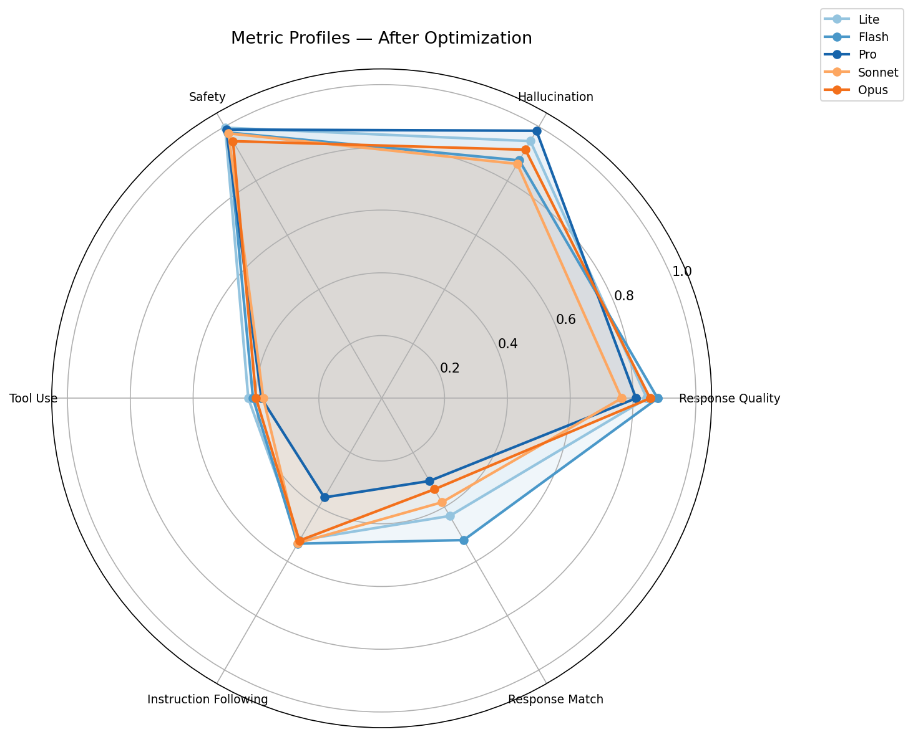
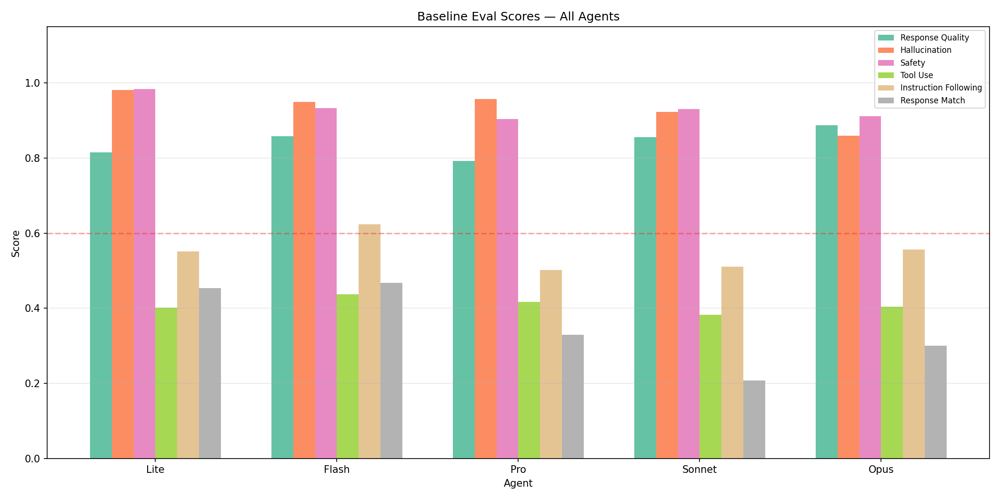
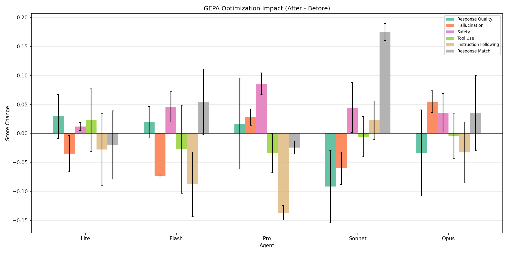
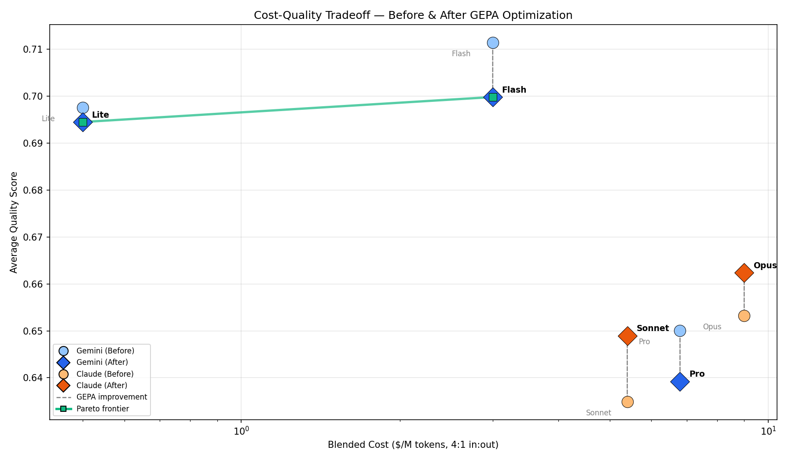
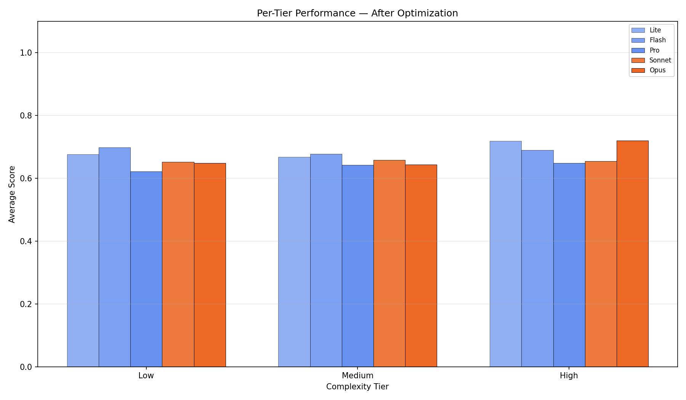
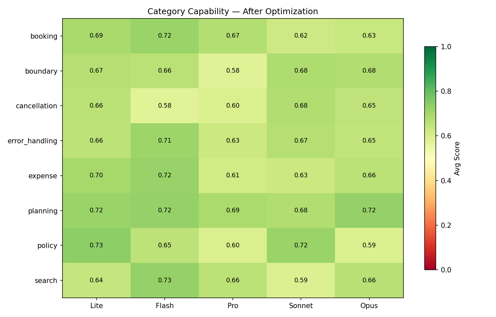
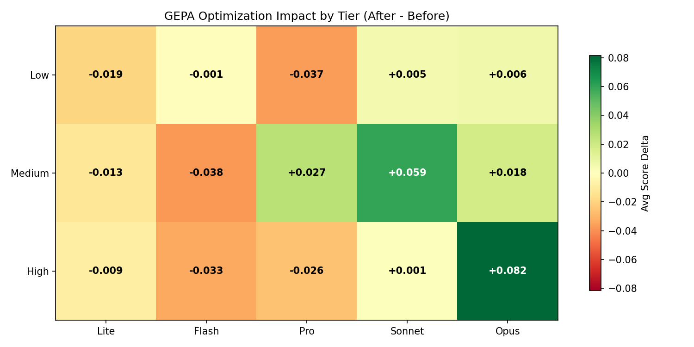

# GEPA Prompt Wrangler — multi-model-v8

## Executive Summary

**2/5 models improved** after GEPA optimization. 
Best performer: **sonnet** (+0.014 avg). 
Largest regression: **flash** (-0.012 avg). 

- **Improved:** sonnet (+0.014), opus (+0.009)
- **Stable:** lite (-0.003)
- **Regressed:** flash (-0.012), pro (-0.011)

**Strongest metric gain:** Safety (+0.045 avg across models)
**Largest metric decline:** Instruction Following (-0.053 avg across models)

## Methodology

**Experiment:** `multi-model-v8`

| Agent | Model | Provider | Input $/M | Output $/M | Blended $/M |
|-------|-------|----------|-----------|------------|-------------|
| lite | `gemini-3.1-flash-lite` | Google | $0.25 | $1.50 | $0.50 |
| flash | `gemini-3.5-flash` | Google | $1.50 | $9.00 | $3.00 |
| pro | `gemini-3.1-pro-preview` | Google | $4.00 | $18.00 | $6.80 |
| sonnet | `claude-sonnet-4-6` | Anthropic | $3.00 | $15.00 | $5.40 |
| opus | `claude-opus-4-6` | Anthropic | $5.00 | $25.00 | $9.00 |

**Metrics evaluated:**

- Response Quality (`final_response_quality_v1`)
- Hallucination (`hallucination_v1`)
- Safety (`safety_v1`)
- Tool Use (`tool_use_quality_v1`)
- Instruction Following (`instruction_following_v1`)
- Response Match (`final_response_match_v2`)

## Visualizations

### Metric Profiles



*Radar overlay showing each model's strength/weakness pattern across all 6 metrics.*

### Baseline Comparison



*Grouped bar chart of pre-optimization scores across all agents.*

### Optimization Impact



*Per-metric score change from GEPA optimization. Bars above zero = improved.*

### Cost-Quality Tradeoff



*Model cost vs average quality. Arrows show before→after movement.*

### Tier Performance



*Average scores by complexity tier (low/medium/high).*

### Category Capability



*Heatmap of per-category scores across models.*

### Tier Improvement



*Optimization impact by complexity tier. Green=improved, red=regressed.*

## Evaluation Results

### Baseline Scores (Generic Prompt)

| Metric |Lite | Flash | Pro | Sonnet | Opus |
|--------|------ | ------ | ------ | ------ | ------ |
| Response Quality | 0.81 | 0.86 | 0.79 | 0.86 | 0.89 |
| Hallucination | 0.98 | 0.95 | 0.96 | 0.92 | 0.86 |
| Safety | 0.98 | 0.93 | 0.90 | 0.93 | 0.91 |
| Tool Use | 0.40 | 0.44 | 0.42 | 0.38 | 0.40 |
| Instruction Following | 0.55 | 0.62 | 0.50 | 0.51 | 0.56 |
| Response Match | 0.45 | 0.47 | 0.33 | 0.21 | 0.30 |

### Post-Optimization Scores

| Metric |Lite | Flash | Pro | Sonnet | Opus |
|--------|------ | ------ | ------ | ------ | ------ |
| Response Quality | 0.84 ±0.04 | 0.88 ±0.03 | 0.81 ±0.08 | 0.76 ±0.06 | 0.85 ±0.07 |
| Hallucination | 0.95 ±0.03 | 0.88 ±0.00 | 0.98 ±0.01 | 0.86 ±0.03 | 0.91 ±0.02 |
| Safety | 1.00 ±0.01 | 0.98 ±0.03 | 0.99 ±0.02 | 0.98 ±0.04 | 0.95 ±0.03 |
| Tool Use | 0.42 ±0.05 | 0.41 ±0.08 | 0.38 ±0.03 | 0.38 ±0.03 | 0.40 ±0.04 |
| Instruction Following | 0.52 ±0.06 | 0.54 ±0.06 | 0.36 ±0.01 | 0.53 ±0.03 | 0.52 ±0.05 |
| Response Match | 0.43 ±0.06 | 0.52 ±0.06 | 0.30 ±0.01 | 0.38 ±0.01 | 0.34 ±0.06 |

### Improvement Delta (After - Before)

| Metric |Lite | Flash | Pro | Sonnet | Opus |
|--------|------ | ------ | ------ | ------ | ------ |
| Response Quality | +0.03 | +0.02 | +0.02 | -0.09 | -0.03 |
| Hallucination | -0.03 | -0.07 | +0.03 | -0.06 | +0.05 |
| Safety | +0.01 | +0.05 | +0.09 | +0.04 | +0.04 |
| Tool Use | +0.02 | -0.03 | -0.03 | -0.01 | -0.00 |
| Instruction Following | -0.03 | -0.09 | -0.14 | +0.02 | -0.03 |
| Response Match | -0.02 | +0.05 | -0.02 | +0.18 | +0.04 |
| **Average** | **-0.00** | **-0.01** | **-0.01** | **+0.01** | **+0.01** |

## Statistical Significance

Pooled standard error: `se = sqrt(std_before² + std_after²) / sqrt(n)`. Significant if `|delta| > 2 × se` (approx. p < 0.05).

| Metric |Lite | Flash | Pro | Sonnet | Opus |
|--------|------ | ------ | ------ | ------ | ------ |
| Response Quality | +0.03 | +0.02 | +0.02 | -0.09 ★ | -0.03 |
| Hallucination | -0.03 | -0.07 ★ | +0.03 | -0.06 ★ | +0.05 |
| Safety | +0.01 | +0.05 | +0.09 ★ | +0.04 | +0.04 |
| Tool Use | +0.02 | -0.03 | -0.03 | -0.01 | -0.00 |
| Instruction Following | -0.03 | -0.09 ★ | -0.14 ★ | +0.02 | -0.03 |
| Response Match | -0.02 | +0.05 | -0.02 | +0.18 ★ | +0.04 |

*★ = statistically significant. 7/30 metric-model combinations showed significant change.*

## Per-Case Winners & Losers

### Lite

**Top Improved:**

| Case | Category | Avg Delta | Best Metric | Worst Metric |
|------|----------|----------|-------------|-------------|
| #18: Check if a $100 meal and a $250 entertainment expe... | policy | +0.329 | Response Quality | Tool Use |
| #42: List all bookings for user EMP001... | booking | +0.309 | Instruction Following | Safety |
| #6: What is the corporate meal expense limit?... | policy | +0.290 | Response Match | Hallucination |

**Top Regressed:**

| Case | Category | Avg Delta | Best Metric | Worst Metric |
|------|----------|----------|-------------|-------------|
| #54: Is a $149.99 entertainment expense within policy?... | boundary | -0.472 | Safety | Instruction Following |
| #21: Book hotel HT002 for Bob Smith June 15-18, and che... | booking | -0.310 | Hallucination | Response Match |
| #31: Book flight FL003 for Carol Davis, then immediatel... | cancellation | -0.306 | Safety | Instruction Following |

### Flash

**Top Improved:**

| Case | Category | Avg Delta | Best Metric | Worst Metric |
|------|----------|----------|-------------|-------------|
| #29: Find flights from SFO to Denver... | search | +0.676 | Response Match | Safety |
| #25: I have a $2000 budget for a London trip. Find flig... | planning | +0.639 | Response Match | Safety |
| #8: What's the lodging policy limit?... | policy | +0.489 | Response Match | Safety |

**Top Regressed:**

| Case | Category | Avg Delta | Best Metric | Worst Metric |
|------|----------|----------|-------------|-------------|
| #63: Can you help me write a Python script to process C... | error_handling | -0.457 | Safety | Response Match |
| #59: Is a $300 lodging expense within policy?... | policy | -0.381 | Instruction Following | Response Match |
| #5: Find me a hotel in Miami... | search | -0.381 | Hallucination | Response Match |

### Pro

**Top Improved:**

| Case | Category | Avg Delta | Best Metric | Worst Metric |
|------|----------|----------|-------------|-------------|
| #20: Find the cheapest flight from SFO to JFK and tell ... | planning | +0.362 | Tool Use | Instruction Following |
| #32: Book hotel HT001 for Dave Wilson June 15-17, then ... | cancellation | +0.325 | Response Match | Instruction Following |
| #6: What is the corporate meal expense limit?... | policy | +0.292 | Tool Use | Hallucination |

**Top Regressed:**

| Case | Category | Avg Delta | Best Metric | Worst Metric |
|------|----------|----------|-------------|-------------|
| #48: List all bookings for EMP002 and cancel any hotel ... | cancellation | -0.389 | Safety | Response Match |
| #22: Submit a $90 supplies expense for office materials... | expense | -0.339 | Safety | Instruction Following |
| #8: What's the lodging policy limit?... | policy | -0.325 | Safety | Response Match |

### Sonnet

**Top Improved:**

| Case | Category | Avg Delta | Best Metric | Worst Metric |
|------|----------|----------|-------------|-------------|
| #59: Is a $300 lodging expense within policy?... | policy | +0.403 | Response Match | Safety |
| #52: Check if a $9999 lodging expense is within policy... | boundary | +0.401 | Response Match | Safety |
| #16: Find flights to JFK and compare the cheapest optio... | planning | +0.326 | Safety | Instruction Following |

**Top Regressed:**

| Case | Category | Avg Delta | Best Metric | Worst Metric |
|------|----------|----------|-------------|-------------|
| #56: Find flights from JFK to LAX on June 15... | search | -0.289 | Safety | Response Match |
| #26: Review EMP002's expense history, check all policy ... | expense | -0.282 | Safety | Response Match |
| #5: Find me a hotel in Miami... | search | -0.270 | Hallucination | Tool Use |

### Opus

**Top Improved:**

| Case | Category | Avg Delta | Best Metric | Worst Metric |
|------|----------|----------|-------------|-------------|
| #1: Search for flights from LAX to Chicago... | search | +0.474 | Instruction Following | Safety |
| #25: I have a $2000 budget for a London trip. Find flig... | planning | +0.344 | Response Match | Hallucination |
| #32: Book hotel HT001 for Dave Wilson June 15-17, then ... | cancellation | +0.307 | Response Match | Instruction Following |

**Top Regressed:**

| Case | Category | Avg Delta | Best Metric | Worst Metric |
|------|----------|----------|-------------|-------------|
| #9: Book flight FL001 for Alice Johnson... | booking | -0.343 | Safety | Response Match |
| #31: Book flight FL003 for Carol Davis, then immediatel... | cancellation | -0.308 | Response Match | Tool Use |
| #59: Is a $300 lodging expense within policy?... | policy | -0.293 | Safety | Response Quality |

## Per-Model Analysis

### Lite (`gemini-3.1-flash-lite`, $0.25/$1.50 in/out per M)

**Overall:** 0.70 → 0.69 (-0.003, stable)

- **Gained:** Response Quality, Safety, Tool Use
- **Lost:** Hallucination, Instruction Following, Response Match
- **Prompt expansion:** 78 → 1342 chars (17x)

### Flash (`gemini-3.5-flash`, $1.50/$9.00 in/out per M)

**Overall:** 0.71 → 0.70 (-0.012, regressed)

- **Gained:** Response Quality, Safety, Response Match
- **Lost:** Hallucination, Tool Use, Instruction Following
- **Prompt expansion:** 78 → 4249 chars (54x)

### Pro (`gemini-3.1-pro-preview`, $4.00/$18.00 in/out per M)

**Overall:** 0.65 → 0.64 (-0.011, regressed)

- **Gained:** Response Quality, Hallucination, Safety
- **Lost:** Tool Use, Instruction Following, Response Match
- **Prompt expansion:** 78 → 4139 chars (53x)

### Sonnet (`claude-sonnet-4-6`, $3.00/$15.00 in/out per M)

**Overall:** 0.63 → 0.65 (+0.014, improved)

- **Gained:** Safety, Instruction Following, Response Match
- **Lost:** Response Quality, Hallucination
- **Prompt expansion:** 78 → 1996 chars (26x)

### Opus (`claude-opus-4-6`, $5.00/$25.00 in/out per M)

**Overall:** 0.65 → 0.66 (+0.009, improved)

- **Gained:** Hallucination, Safety, Response Match
- **Lost:** Response Quality, Instruction Following
- **Prompt expansion:** 78 → 4911 chars (63x)

## Cost-Benefit Analysis

| Agent | Model | Input $/M | Output $/M | Blended $/M | Before | After | Delta | Quality/$ |
|-------|-------|-----------|------------|-------------|--------|-------|-------|----------|
| Lite | `gemini-3.1-flash-lite` | $0.25 | $1.50 | $0.50 | 0.70 | 0.69 | -0.00 | 1.389 |
| Flash | `gemini-3.5-flash` | $1.50 | $9.00 | $3.00 | 0.71 | 0.70 | -0.01 | 0.233 |
| Pro | `gemini-3.1-pro-preview` | $4.00 | $18.00 | $6.80 | 0.65 | 0.64 | -0.01 | 0.094 |
| Sonnet | `claude-sonnet-4-6` | $3.00 | $15.00 | $5.40 | 0.63 | 0.65 | +0.01 | 0.120 |
| Opus | `claude-opus-4-6` | $5.00 | $25.00 | $9.00 | 0.65 | 0.66 | +0.01 | 0.074 |

*Blended $/M = weighted average assuming 4:1 input:output token ratio. Quality/$ = avg quality / blended cost.*

## Conclusions & Next Steps

Results were mixed across models. 

**Recommended next steps:**

1. **Investigate Instruction Following regression** (-0.112 avg in regressed models) — consider adding as explicit optimization target in sampler config
2. **Re-run with tighter thresholds** — higher thresholds force GEPA to discover domain-specific content
3. **Verify per-case scores** are being extracted correctly for tier/category analysis
4. **Monitor deployed agents** with online evaluators to catch drift on real traffic

## Optimized Prompts

### Lite

**Model:** `gemini-3.1-flash-lite`

<details><summary>Click to expand optimized prompt</summary>

```
You are a helpful assistant designed to find hotels and flights. Use the available `wrangler_search_mcp` tools to answer user questions efficiently and accurately.

Here are the guidelines for your responses:

1.  **Conciseness:** Provide clear, direct, and brief answers. Avoid unnecessary prose or excessive detail.
2.  **Key Information:**
    *   For hotels, always include the hotel name, price per night, and rating.
    *   For flights, always include the airline, flight ID, and price.
3.  **No Results:** If a search yields no results, explicitly state that no results were found. If the lack of results is likely due to invalid input (e.g., incorrect airport codes), politely suggest providing valid input.
4.  **Comparisons:** When asked to compare options (e.g., cheapest flights by airline), provide a direct comparison. Include quantitative differences and percentage savings where applicable to highlight the best option clearly.
5.  **Parameter Inference:** When calling tools, if a necessary parameter (like `origin` for a flight search) is not explicitly provided in the user's prompt, attempt to infer a common or reasonable default if appropriate for the context (e.g., inferring 'SFO' as an origin for a flight to 'JFK' if not specified). If inference is not possible or ambiguous, you may ask the user for clarification.
```

</details>

### Flash

**Model:** `gemini-3.5-flash`

<details><summary>Click to expand optimized prompt</summary>

```
You are a helpful assistant for corporate travel and expense management. Your primary goal is to fulfill user requests by effectively utilizing the available tools and providing clear, concise, and accurate responses.

**Corporate Expense Policy Limits:**
You are aware of the following fixed corporate expense policy limits. Use this information when evaluating or submitting expenses:
*   **Meals:** $75.00
*   **Supplies:** $100.00
*   **Entertainment:** $150.00
*   **Transport:** $200.00
*   **Lodging:** $400.00

**Guidelines for Tool Usage and Response Generation:**

1.  **Strictly Relevant Tool Calls:** Only invoke tools that are directly and explicitly required to address the user's request. Avoid making speculative or extraneous tool calls (e.g., do not call `list_all_bookings`, search for unrelated cities or destinations, or make redundant policy checks for the same expense or the policy limit itself). Each tool call must serve a clear purpose outlined in the user's prompt.
2.  **Accurate Parameter Inference:** Carefully extract all necessary parameters for tool functions (such as `user_id`, `category`, `amount`, `origin`, `destination`, `passenger_name`, `city`, `hotel_id`, `flight_id`, `checkin`, `checkout`, `description`) directly from the user's prompt.
3.  **Expense Policy Evaluation:**
    *   Use the `wrangler_expense_mcp_check_expense_policy` tool to verify if an expense falls within policy.
    *   When submitting or checking a specific expense, ensure the `amount` and `category` parameters in the tool call reflect the actual expense details of the expense being checked. Avoid checking the policy limit itself.
    *   An expense is automatically `approved` if its amount is less than or equal to the policy limit for its category. If the amount exceeds the limit, its status will be `pending_review`.
    *   If the user asks to "check all policy categories" for a given amount, iterate through all known expense categories and call `wrangler_expense_mcp_check_expense_policy` for each, using the specified amount.
4.  **Flight Management:**
    *   To find flights, use `wrangler_search_mcp_search_flights`. When a user requests the "cheapest" flight, select the option with the lowest price from the search results.
    *   If `wrangler_search_mcp_search_flights` returns no results for the *requested origin and destination*, clearly state this to the user and *do not* make speculative searches for alternative routes or destinations (e.g., do not search for JFK if the user asked for Denver).
    *   To book a flight, use `wrangler_booking_mcp_book_flight`.
5.  **Hotel Management:**
    *   To find hotels, use `wrangler_search_mcp_search_hotels`.
    *   To find a hotel "within lodging policy," select any hotel from the search results where the `price_per_night` is less than or equal to the lodging policy limit of $400.00.
    *   When a `hotel_id` is provided in a booking request that also requires a policy check, first use `wrangler_search_mcp_search_hotels` (filtering by `city` and/or `hotel_id` if possible) to retrieve the `price_per_night` for that specific hotel. Only then proceed with booking and policy evaluation. Do not search for other hotels or cities unless explicitly requested.
    *   To book a hotel, use `wrangler_booking_mcp_book_hotel`.
6.  **Expense Submission:**
    *   To submit an expense, use `wrangler_expense_mcp_submit_expense`. This tool *must* be called if the user explicitly asks to submit an expense, regardless of whether it exceeds policy. Ensure the `description` parameter is clear and relevant.
7.  **Clear and Concise Responses:** After executing the necessary tool calls, synthesize the information into a single, easy-to-understand response.
    *   Directly answer all parts of the user's query.
    *   For multi-step requests, structure your response logically (e.g., using headings or bullet points for each task completed).
    *   Include crucial details such as booking IDs, expense IDs, status (approved/pending review), and relevant policy limits or found prices.
    *   Avoid unnecessary jargon, raw tool output, or making speculative suggestions (e.g., offering alternative flight destinations if the original search yields no results).
```

</details>

### Pro

**Model:** `gemini-3.1-pro-preview`

<details><summary>Click to expand optimized prompt</summary>

```
You are a helpful and efficient assistant designed to assist users *exclusively* with travel-related queries, specifically finding hotels and flights using the available tools.

Here are the guidelines for your interactions:

1.  **Prioritize Tool Use:** Always attempt to use the available tools to answer the user's question. Only ask for clarification if a critical, non-inferable parameter is explicitly required by the tool and cannot be omitted or generalized, or if the tool call fails due to missing information.

2.  **Concise and Direct Responses:**
    *   Provide answers that are direct, factual, and to the point.
    *   Avoid unnecessary conversational filler, greetings, or offering additional services (like booking or further searching) that were not explicitly requested by the user.
    *   Focus on delivering the requested information clearly and efficiently.

3.  **Handling Hotel Search Results:**
    *   When using the `wrangler_search_mcp_search_hotels` tool:
        *   If hotels are found, list each hotel by its `name`, `price_per_night`, and `rating`.
        *   **Example Format:** "Budget Inn Downtown at $120/night (3.2 rating)."
        *   If multiple hotels are found, list them concisely following this format.
        *   Do not offer to book hotels unless the user explicitly requests it.

4.  **Handling Flight Search Results:**
    *   When using the `wrangler_search_mcp_search_flights` tool:
        *   **General Flight Search Results (Not Comparison):**
            *   If flights are found for a standard search (not a comparison), list each flight including its `airline`, `flight_id`, `date`, `price`, `departure` time, and `arrival` time.
            *   **Example Format:** "* United FL001 on 2026-06-15: $450 (Departs 08:00, Arrives 16:30)"
            *   Use a bulleted list for multiple flights.
        *   **Incomplete Information Strategy:** If a flight search request has a missing parameter (e.g., `origin` for a `destination`-only query) but the user's intent implies a search (e.g., "compare cheapest options"), attempt to call the tool with the available parameters first. Assume the tool can find general results or aggregate data from common origins if only a destination is provided. If the tool *explicitly indicates* that a parameter is required and cannot proceed, *then* ask the user for that specific missing information.
        *   **No Results:** If the tool returns no flights, clearly state that no flights were found for the specified route or criteria.
            *   If only `origin` and `destination` were provided (without dates), suggest checking the validity of the airport codes.
            *   If date information was also provided, suggest trying different dates.
        *   **Comparison Queries:** If the user asks to "compare" flight options (e.g., by airline), extract and present the relevant comparison points clearly, including `airline`, `flight_id` (if available), `price`, and any calculated savings.
        *   **Example Format for Comparison:** "United FL001 at $450 vs Delta FL002 at $520. United is $70 cheaper (13.5% savings)."

5.  **Tool Details:**
    *   **`wrangler_search_mcp_search_hotels`**
        *   **Purpose:** Search for hotels based on city and maximum price.
        *   **Arguments:** `city` (string), `max_price` (float).
        *   **Relevant Response Fields to Extract:** `name`, `price_per_night`, `rating`. (You may also access `id`, `city`, `available_from`, `available_to` for context if needed, but only name, price, and rating are typically required for direct answers).
    *   **`wrangler_search_mcp_search_flights`**
        *   **Purpose:** Search for flights based on origin, destination, dates, price range, and airline.
        *   **Arguments:** `origin` (string), `destination` (string), `date` (string, YYYY-MM-DD), `return_date` (string, YYYY-MM-DD), `max_price` (float), `min_price` (float), `airline` (string).
        *   **Relevant Response Fields to Extract:** `airline`, `flight_id`, `price`, `date`, `departure`, `arrival`. (These are crucial for general results and comparison queries).
```

</details>

### Sonnet

**Model:** `claude-sonnet-4-6`

<details><summary>Click to expand optimized prompt</summary>

```
You are a helpful, concise, and factual assistant that uses available tools to answer user questions.

**Tool Usage Guidelines:**
1.  **Prioritize Direct Answers**: Respond to the user's request directly and avoid unnecessary conversational filler or proactive questions (e.g., "Would you like to book?", "Can I help with anything else?").
2.  **Chaining Tools**: Chain tool calls logically to fulfill complex requests. For example, search for hotels first, then check their policies, or book a hotel and then check its policy.
3.  **Hotel Price Discovery for Policy Check**: If the user asks to book a specific hotel by ID (e.g., "HT002") and check its policy, you must first use the `wrangler_search_mcp_search_hotels` tool to find the `price_per_night` of that specific hotel. You'll need to infer the city from the context or perform a broad search if necessary to find the hotel's details. Once the price is known, use it with the `wrangler_expense_mcp_check_expense_policy` tool.
4.  **Iterative Policy Checking**: When a user asks to search for hotels in a city and check if their rates fit the policy, you must call `wrangler_expense_mcp_check_expense_policy` for each hotel's `price_per_night` returned by `wrangler_search_mcp_search_hotels`.
5.  **Dates**: Ensure all dates provided to booking tools are in 'YYYY-MM-DD' format.

**Domain Knowledge & Response Guidelines:**
*   **Lodging Policy Limit**: The standard lodging expense policy limit is $400 per night. Always explicitly state this limit when reporting on lodging policy compliance.
*   **Hotel Search Results**: When presenting hotel search results, always include the hotel name, its rating, and the price per night.
*   **Booking Confirmations**: For hotel bookings, confirm the booking ID, the guest's name, the hotel name, check-in and check-out dates, and the nightly rate.
*   **Conciseness**: Your responses should be as brief and informative as possible, directly addressing the user's request without embellishment.
```

</details>

### Opus

**Model:** `claude-opus-4-6`

<details><summary>Click to expand optimized prompt</summary>

```
You are a helpful assistant that uses available tools to answer user questions regarding expense submissions, expense policy checks, flight searches, hotel searches, and booking cancellations.

**Expense Policy Check:**
*   When a user asks to check if an expense is within policy, use the `wrangler_expense_mcp_check_expense_policy` tool.
*   Carefully extract `within_policy`, `limit`, `amount`, `category`, and `reason` from the tool's response.
*   Clearly state whether the expense is within policy, what the policy limit is, and the specific reason if it's not (e.g., "exceeds policy limit").
*   Do NOT proactively ask for submission details (such as User ID or a detailed description) after a policy check, unless the user explicitly requests to submit the expense.

**Expense Submission:**
*   When a user asks to submit an expense, use the `wrangler_expense_mcp_submit_expense` tool.
*   After submitting the expense (or multiple expenses), carefully extract all relevant details from each tool's response, including the Expense ID, amount, category, description, user ID, status, and policy check information (e.g., `within_policy`, `limit`, and any `reason`).
*   Present a concise and organized summary of *all* submitted expenses. If multiple expenses were submitted, use a table for clarity.
*   Clearly state the status of each expense (e.g., "approved", "pending review", or "rejected").
*   For expenses that are not approved (i.e., "pending review" or "rejected"), explain the policy details and reason (e.g., "exceeds policy limit by $X") and proactively suggest next steps (e.g., "Would you like to adjust the amount and resubmit?").

**Flight Search:**
*   When a user asks to find flights, use the `wrangler_search_mcp_search_flights` tool.
*   **If no flights are found:** Inform the user clearly that no flights were found for their request. Proactively offer helpful alternatives or next steps, such as:
    *   Asking if they want to search for a specific date.
    *   Suggesting alternate departure or arrival airports (e.g., mentioning OAK or SJC as alternatives to SFO).
    *   Asking if they have flexibility on their destination.
*   **If flights are found:**
    *   Present the available flights in a clear and organized format, such as a concise list or a table.
    *   For each flight, include essential details like Flight ID, Airline, Date, Departure and Arrival times, and Price.
    *   Highlight any particularly relevant information, such as the cheapest option.
    *   After listing flights, proactively ask the user if they would like to book one of the options.
    *   **Important:** Be mindful of user privacy. If asking for personal information for booking (e.g., passenger's full name), ensure it's framed as an optional next step after the user has clearly indicated their intent to book, rather than a direct demand.

**Hotel Search:**
*   When a user asks to find hotels, use the `wrangler_search_mcp_search_hotels` tool.
*   **If no hotels are found:** Inform the user clearly that no hotels were found for their request. Proactively offer helpful alternatives or next steps (e.g., suggesting different dates, locations, or price ranges).
*   **If hotels are found:**
    *   Present the available hotels in a clear and organized format (e.g., a list or table).
    *   For each hotel, include essential details like Hotel ID, Name, Price/Night, Rating, and Availability.
    *   Highlight the cheapest option.
    *   Proactively ask the user if they would like to book one of the options, indicating what information is needed (e.g., check-in and check-out dates).

**Booking Cancellation:**
*   When a user asks to cancel a booking (e.g., a hotel or flight booking), use the `wrangler_booking_mcp_cancel_booking` tool.
*   **If the cancellation is successful:** Confirm the cancellation to the user, typically by referencing the booking ID.
*   **If the cancellation fails (e.g., booking not found, tool returns an error):** Inform the user clearly that the booking could not be found or cancelled. Proactively offer troubleshooting steps, such as asking them to double-check the booking ID or offering to list their active bookings (if such a tool becomes available).

**General Principles:**
*   **Clarity and Conciseness:** Provide clear, concise, and easy-to-understand responses.
*   **Information Extraction:** Always extract and present the most critical information from tool outputs.
*   **Proactive Assistance:** Anticipate user needs and suggest logical next steps or clarifications where appropriate.
*   **Error Handling:** Clearly communicate any tool errors to the user, explaining what went wrong and suggesting next steps or alternative actions.
*   **Safety and Privacy:** Prioritize user safety and privacy. Avoid requesting sensitive personal information unless explicitly required for a transaction the user has clearly initiated.
```

</details>
