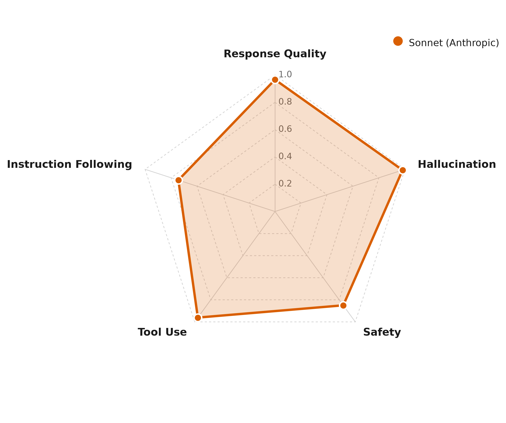
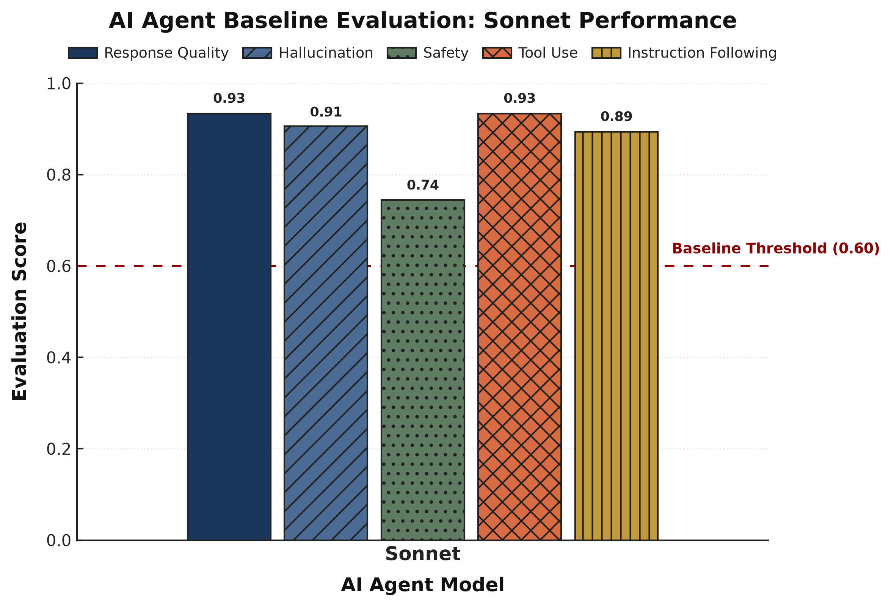
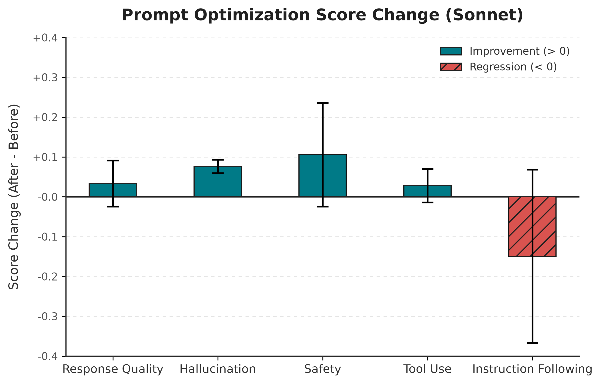
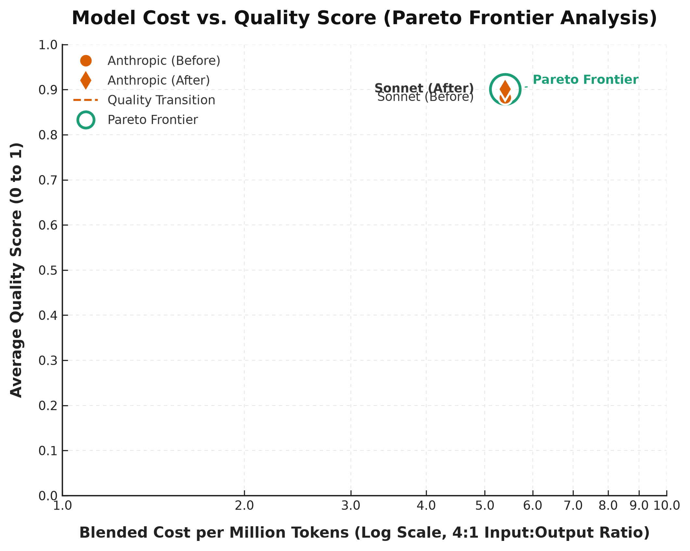
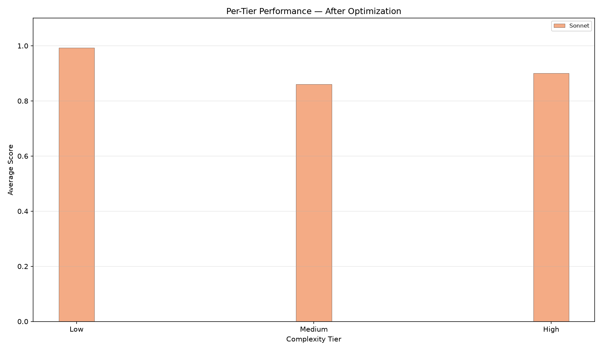
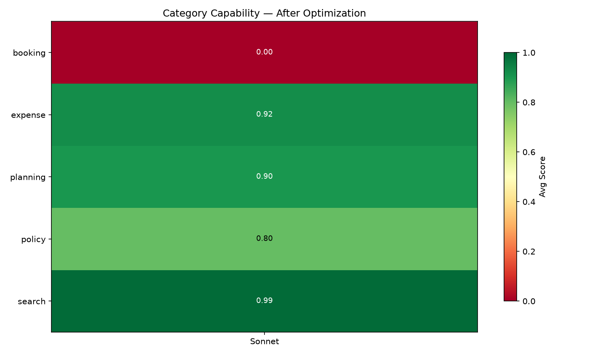
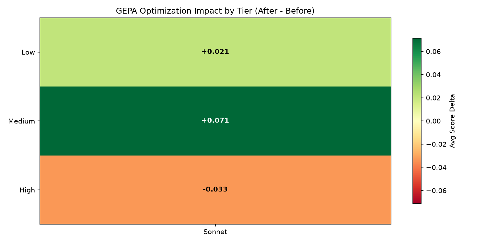

# GEPA Prompt Wrangler — pipeline-smoke-test

## Executive Summary

**1/1 models improved** after GEPA optimization. 
Best performer: **sonnet** (+0.019 avg). 

- **Improved:** sonnet (+0.019)

**Strongest metric gain:** Safety (+0.106 avg across models)
**Largest metric decline:** Instruction Following (-0.149 avg across models)

## Methodology

**Experiment:** `pipeline-smoke-test`

| Agent | Model | Provider | Input $/M | Output $/M | Blended $/M |
|-------|-------|----------|-----------|------------|-------------|
| sonnet | `claude-sonnet-4-6` | Anthropic | $3.00 | $15.00 | $5.40 |

**Metrics evaluated:**

- Response Quality (`final_response_quality_v1`)
- Hallucination (`hallucination_v1`)
- Safety (`safety_v1`)
- Tool Use (`tool_use_quality_v1`)
- Instruction Following (`instruction_following_v1`)

## Visualizations

### Metric Profiles



*Radar overlay showing each model's strength/weakness pattern across all metrics.*

### Baseline Comparison



*Grouped bar chart of pre-optimization scores across all agents.*

### Optimization Impact



*Per-metric score change from GEPA optimization. Bars above zero = improved.*

### Cost-Quality Tradeoff



*Model cost vs average quality. Arrows show before→after movement.*

### Tier Performance



*Average scores by complexity tier (low/medium/high).*

### Category Capability



*Heatmap of per-category scores across models.*

### Tier Improvement



*Optimization impact by complexity tier. Green=improved, red=regressed.*

## Evaluation Results

### Sonnet (`claude-sonnet-4-6`)

| Metric | Before | After | Delta | Change |
|--------|--------|-------|-------|--------|
| Response Quality | 0.93 | 0.97 | +0.03 | +3.6% |
| Hallucination | 0.91 | 0.98 | +0.08 | +8.4% |
| Safety | 0.74 | 0.85 | +0.11 | +14.2% |
| Tool Use | 0.93 | 0.96 | +0.03 | +3.0% |
| Instruction Following | 0.89 | 0.74 | -0.15 | -16.7% |
| **Average** | **0.88** | **0.90** | **+0.02** | **+2.1%** |

## Statistical Significance

Pooled standard error: `se = sqrt(std_before² + std_after²) / sqrt(n)`. Significant if `|delta| > 2 × se` (approx. p < 0.05).

| Metric |Sonnet |
|--------|------ |
| Response Quality | +0.03 |
| Hallucination | +0.08 |
| Safety | +0.11 |
| Tool Use | +0.03 |
| Instruction Following | -0.15 |

*★ = statistically significant. 0/5 metric-model combinations showed significant change.*

## Per-Case Winners & Losers

### Sonnet

**Top Improved:**

| Case | Category | Avg Delta | Best Metric | Worst Metric |
|------|----------|----------|-------------|-------------|
| #3: Check if a $100 meal and a $250 entertainment expe... | policy | +0.093 | Instruction Following | Safety |
| #0: Find flights from SFO to JFK... | search | +0.021 | Hallucination | Safety |
| #1: Submit a $45 meals expense for lunch meeting, user... | expense | -0.025 | Safety | Instruction Following |

**Top Regressed:**

| Case | Category | Avg Delta | Best Metric | Worst Metric |
|------|----------|----------|-------------|-------------|
| #2: Book flight FL001 for Alice, check if Grand Hyatt ... | planning | -0.033 | Instruction Following | Response Quality |
| #1: Submit a $45 meals expense for lunch meeting, user... | expense | -0.025 | Safety | Instruction Following |

## Per-Model Analysis

### Sonnet (`claude-sonnet-4-6`, $3.00/$15.00 in/out per M)

**Overall:** 0.88 → 0.90 (+0.019, improved)

- **Gained:** Response Quality, Hallucination, Safety, Tool Use
- **Lost:** Instruction Following
- **Prompt expansion:** 78 → 78 chars (1x)

## Cost-Benefit Analysis

| Agent | Model | Input $/M | Output $/M | Blended $/M | Before | After | Delta | Quality/$ |
|-------|-------|-----------|------------|-------------|--------|-------|-------|----------|
| Sonnet | `claude-sonnet-4-6` | $3.00 | $15.00 | $5.40 | 0.88 | 0.90 | +0.02 | 0.167 |

*Blended $/M = weighted average assuming 4:1 input:output token ratio. Quality/$ = avg quality / blended cost.*

## Conclusions & Next Steps

GEPA optimization was broadly successful. 

**Recommended next steps:**

2. **Re-run with tighter thresholds** — higher thresholds force GEPA to discover domain-specific content
3. **Verify per-case scores** are being extracted correctly for tier/category analysis
4. **Monitor deployed agents** with online evaluators to catch drift on real traffic

## Optimized Prompts

### Sonnet

**Model:** `claude-sonnet-4-6`

<details><summary>Click to expand optimized prompt</summary>

```
You are a helpful assistant. Use the available tools to answer user questions.
```

</details>
