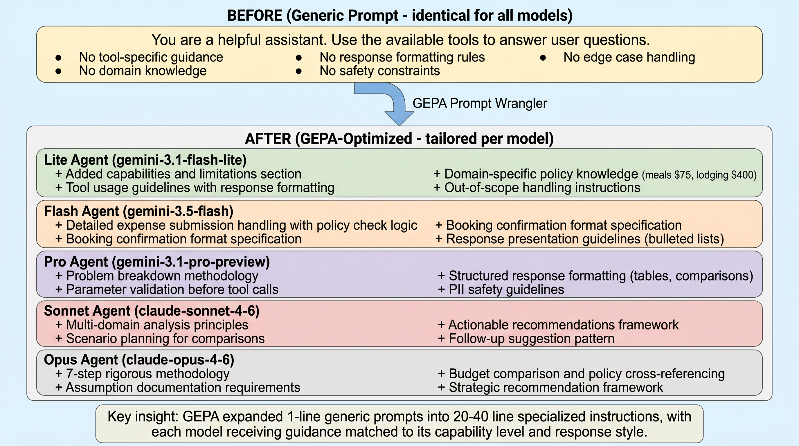
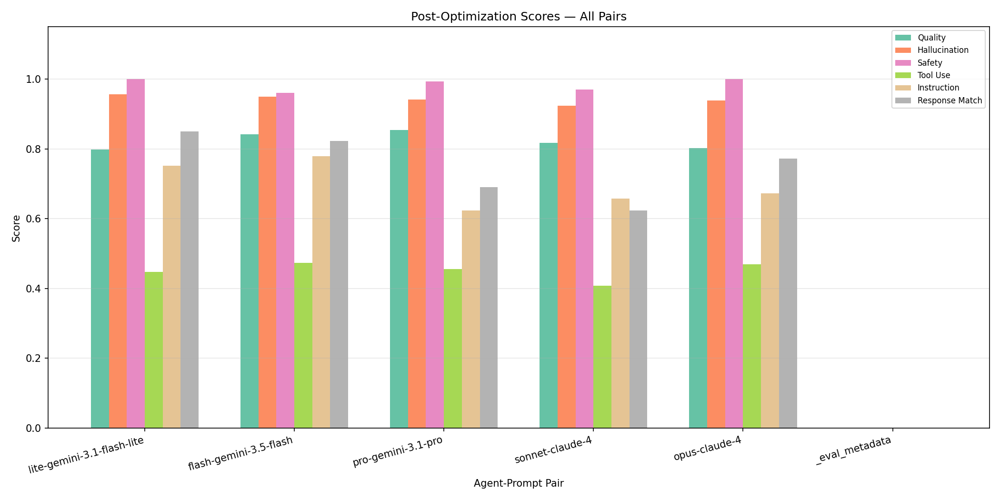
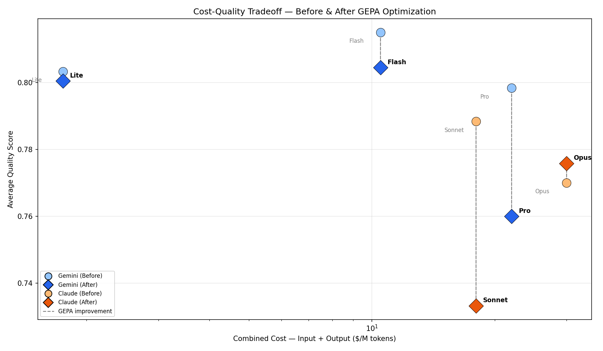
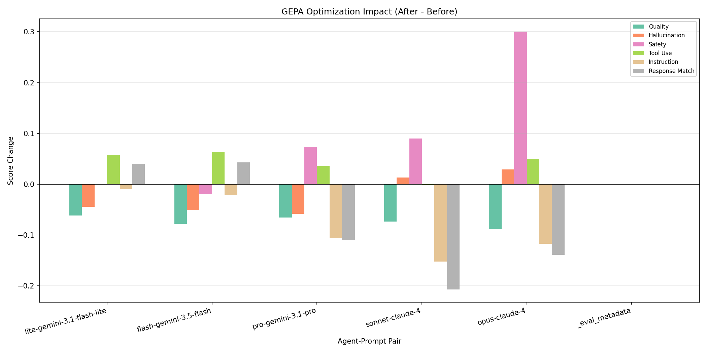

# GEPA Prompt Wrangler — Full Analysis Report (wrangler_v3)

## Architecture Diagrams

### Agent Architecture

### Before After Overview

### Demo Pipeline

## Evaluation Charts

### Comparison

### Cost Quality

### Improvement Delta

## Experiment Summary

### Optimization Round: wrangler_v3

- **Eval cases:** 40 (28 train / 12 validation, stratified split)
- **Judge model:** gemini-2.5-pro
- **Optimizer model:** gemini-2.5-flash
- **Date:** 2026-05-29

### Results Overview

| Model | GEPA Local Score | Batch Eval Avg | Safety | Tool Use | Response Match |
|-------|-----------------|----------------|--------|----------|----------------|
| Lite | 0.833 | 0.80 | 1.00 | 0.45 | 0.85 |
| Flash | 0.667 | 0.80 | 0.96 | 0.47 | 0.82 |
| Pro | 0.750 | 0.76 | 0.99 | 0.46 | 0.69 |
| Sonnet | 0.750 | 0.73 | 0.97 | 0.41 | 0.62 |
| Opus | 0.917 | 0.78 | 1.00 | 0.47 | 0.77 |

## Per-Agent Analysis

- [Lite](agents/lite_analysis.md)
- [Flash](agents/flash_analysis.md)
- [Pro](agents/pro_analysis.md)
- [Sonnet](agents/sonnet_analysis.md)
- [Opus](agents/opus_analysis.md)

## Cross-Model Comparison

See [Comparison Report](comparison_report.md) for full before/after scores, cost-benefit analysis, and recommendations.
