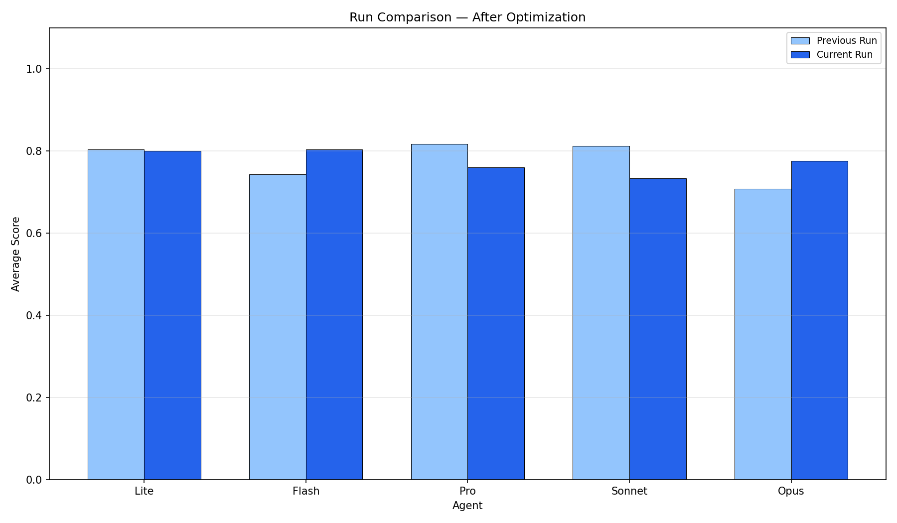

# GEPA Prompt Wrangler — Full Analysis Report

## Architecture Diagrams

### Agent Architecture

### Before After Overview

### Demo Pipeline

## Evaluation Charts

### Comparison

### Cost Quality

### Improvement Delta

### Run Comparison

## Per-Agent Analysis

- [Flash](agents/flash_analysis.md)
- [Lite](agents/lite_analysis.md)
- [Opus](agents/opus_analysis.md)
- [Pro](agents/pro_analysis.md)
- [Sonnet](agents/sonnet_analysis.md)
