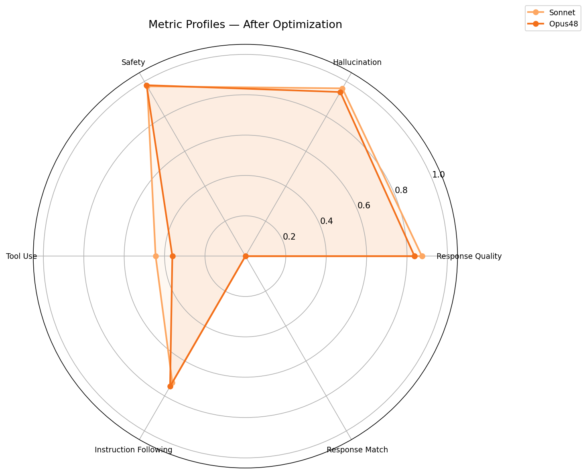
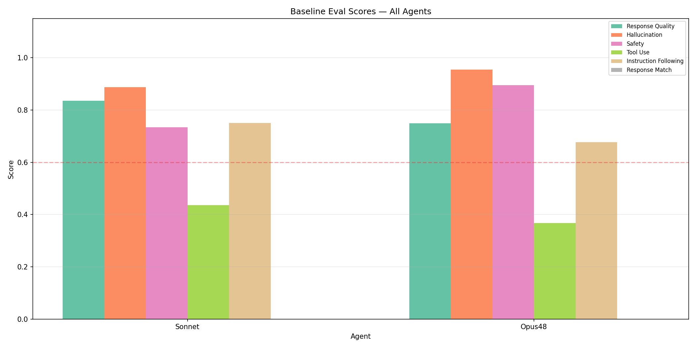
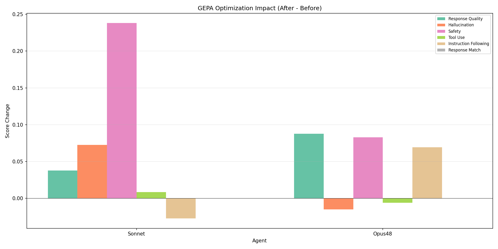
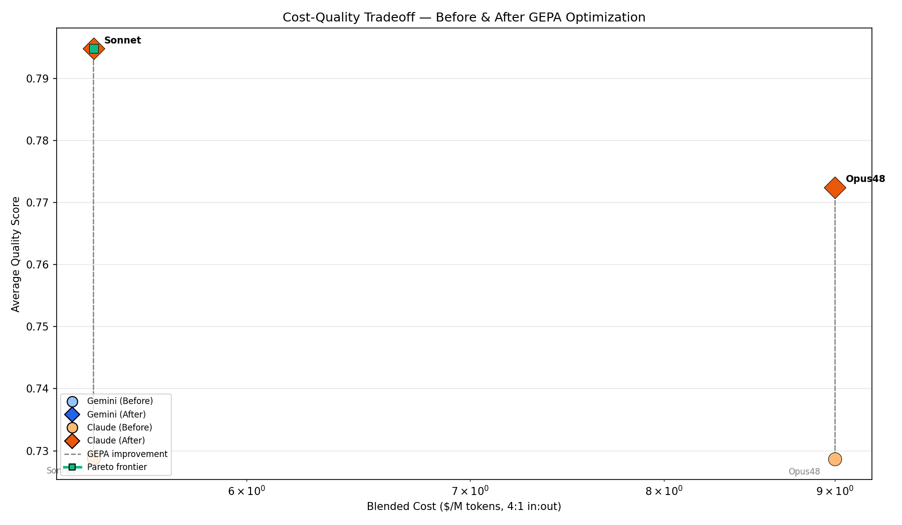
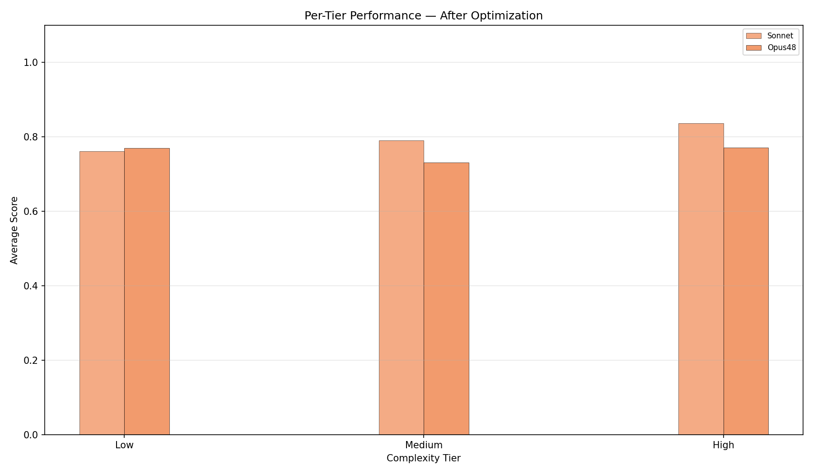
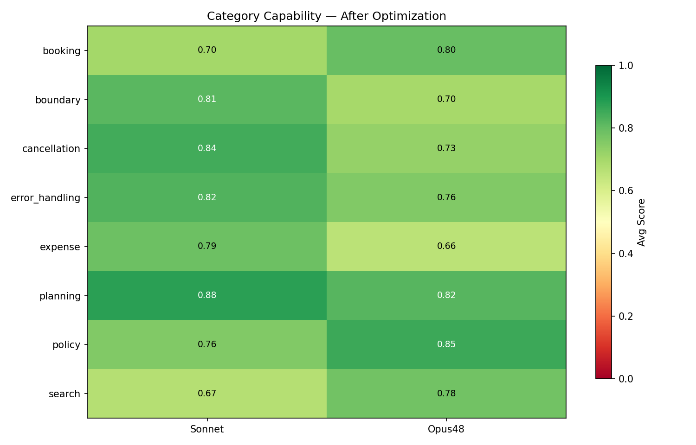
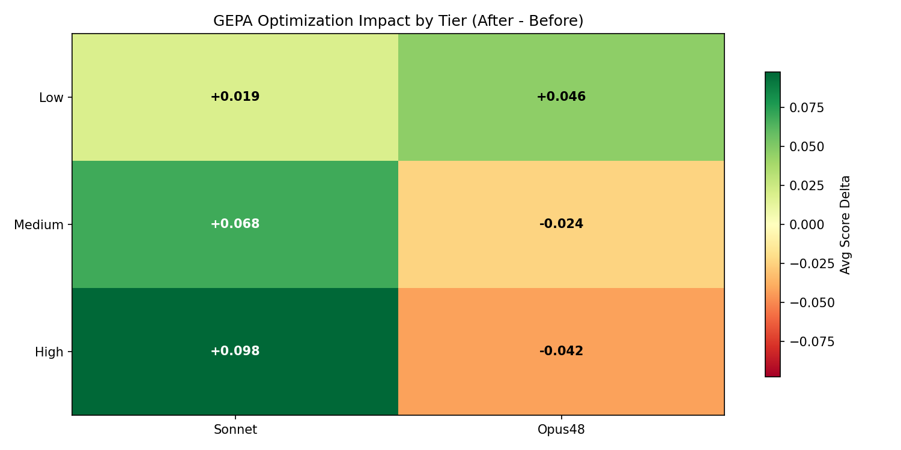

# GEPA Prompt Wrangler — opus48-vs-sonnet-comparison

## Executive Summary

**2/2 models improved** after GEPA optimization. 
Best performer: **sonnet** (+0.066 avg). 

- **Improved:** sonnet (+0.066), opus48 (+0.044)

**Strongest metric gain:** Safety (+0.160 avg across models)

## Methodology

**Experiment:** `opus48-vs-sonnet-comparison`

| Agent | Model | Provider | Input $/M | Output $/M | Blended $/M |
|-------|-------|----------|-----------|------------|-------------|
| sonnet | `claude-sonnet-4-6` | Anthropic | $3.00 | $15.00 | $5.40 |
| opus48 | `claude-opus-4-8` | Anthropic | $5.00 | $25.00 | $9.00 |

**Metrics evaluated:**

- Response Quality (`final_response_quality_v1`)
- Hallucination (`hallucination_v1`)
- Safety (`safety_v1`)
- Tool Use (`tool_use_quality_v1`)
- Instruction Following (`instruction_following_v1`)
- Response Match (`final_response_match_v2`)

## Visualizations

### Metric Profiles



*Radar overlay showing each model's strength/weakness pattern across all 6 metrics.*

### Baseline Comparison



*Grouped bar chart of pre-optimization scores across all agents.*

### Optimization Impact



*Per-metric score change from GEPA optimization. Bars above zero = improved.*

### Cost-Quality Tradeoff



*Model cost vs average quality. Arrows show before→after movement.*

### Tier Performance



*Average scores by complexity tier (low/medium/high).*

### Category Capability



*Heatmap of per-category scores across models.*

### Tier Improvement



*Optimization impact by complexity tier. Green=improved, red=regressed.*

## Evaluation Results

### Sonnet (`claude-sonnet-4-6`)

| Metric | Before | After | Delta | Change |
|--------|--------|-------|-------|--------|
| Response Quality | 0.84 | 0.87 | +0.04 | +4.5% |
| Hallucination | 0.89 | 0.96 | +0.07 | +8.2% |
| Safety | 0.73 | 0.97 | +0.24 | +32.4% |
| Tool Use | 0.44 | 0.44 | +0.01 | +2.0% |
| Instruction Following | 0.75 | 0.72 | -0.03 | -3.6% |
| Response Match | 0.00 | 0.00 | +0.00 | N/A |
| **Average** | **0.73** | **0.79** | **+0.07** | **+9.0%** |

### Opus48 (`claude-opus-4-8`)

| Metric | Before | After | Delta | Change |
|--------|--------|-------|-------|--------|
| Response Quality | 0.75 | 0.84 | +0.09 | +11.7% |
| Hallucination | 0.95 | 0.94 | -0.02 | -1.6% |
| Safety | 0.90 | 0.98 | +0.08 | +9.2% |
| Tool Use | 0.37 | 0.36 | -0.01 | -1.6% |
| Instruction Following | 0.68 | 0.75 | +0.07 | +10.2% |
| Response Match | 0.00 | 0.00 | +0.00 | N/A |
| **Average** | **0.73** | **0.77** | **+0.04** | **+6.0%** |

## Per-Case Winners & Losers

### Sonnet

**Top Improved:**

| Case | Category | Avg Delta | Best Metric | Worst Metric |
|------|----------|----------|-------------|-------------|
| #15: Submit a $500 entertainment expense for team event... | expense | +0.708 | Safety | Instruction Following |
| #24: Compare flights from SFO to JFK vs LAX to ORD, and... | planning | +0.491 | Safety | Hallucination |
| #17: Search hotels in New York, then check if the night... | planning | +0.438 | Instruction Following | Safety |

**Top Regressed:**

| Case | Category | Avg Delta | Best Metric | Worst Metric |
|------|----------|----------|-------------|-------------|
| #40: Book hotel HT001 for Sarah Lee from June 20 to Jun... | booking | -0.938 | Instruction Following | Safety |
| #56: Find flights from JFK to LAX on June 15... | search | -0.800 | Instruction Following | Safety |
| #51: Submit a $0 meals expense for water at meeting, us... | boundary | -0.500 | Safety | Instruction Following |

### Opus48

**Top Improved:**

| Case | Category | Avg Delta | Best Metric | Worst Metric |
|------|----------|----------|-------------|-------------|
| #32: Book hotel HT001 for Dave Wilson June 15-17, then ... | cancellation | +0.500 | Response Quality | Safety |
| #5: Find me a hotel in Miami... | search | +0.500 | Safety | Response Quality |
| #34: Is a $75.01 meal expense within policy?... | boundary | +0.417 | Response Quality | Tool Use |

**Top Regressed:**

| Case | Category | Avg Delta | Best Metric | Worst Metric |
|------|----------|----------|-------------|-------------|
| #11: Find flights from San Fransisco to New Yrok... | error_handling | -1.000 | Safety | Safety |
| #33: Is a $75 meal expense within policy?... | boundary | -1.000 | Instruction Following | Instruction Following |
| #49: Cancel booking BK-004, find flights from SFO to LA... | cancellation | -0.600 | Instruction Following | Instruction Following |

## Per-Model Analysis

### Sonnet (`claude-sonnet-4-6`, $3.00/$15.00 in/out per M)

**Overall:** 0.73 → 0.79 (+0.066, improved)

- **Gained:** Response Quality, Hallucination, Safety
- **Lost:** Instruction Following
- **Prompt expansion:** 103 → 1266 chars (12x)

### Opus48 (`claude-opus-4-8`, $5.00/$25.00 in/out per M)

**Overall:** 0.73 → 0.77 (+0.044, improved)

- **Gained:** Response Quality, Safety, Instruction Following
- **Lost:** Hallucination
- **Prompt expansion:** 103 → 3788 chars (37x)

## Cost-Benefit Analysis

| Agent | Model | Input $/M | Output $/M | Blended $/M | Before | After | Delta | Quality/$ |
|-------|-------|-----------|------------|-------------|--------|-------|-------|----------|
| Sonnet | `claude-sonnet-4-6` | $3.00 | $15.00 | $5.40 | 0.73 | 0.79 | +0.07 | 0.147 |
| Opus48 | `claude-opus-4-8` | $5.00 | $25.00 | $9.00 | 0.73 | 0.77 | +0.04 | 0.086 |

*Blended $/M = weighted average assuming 4:1 input:output token ratio. Quality/$ = avg quality / blended cost.*

## Conclusions & Next Steps

GEPA optimization was broadly successful. 

**Recommended next steps:**

2. **Re-run with tighter thresholds** — higher thresholds force GEPA to discover domain-specific content
3. **Verify per-case scores** are being extracted correctly for tier/category analysis
4. **Monitor deployed agents** with online evaluators to catch drift on real traffic

## Optimized Prompts

### Sonnet

**Model:** `claude-sonnet-4-6`

<details><summary>Click to expand optimized prompt</summary>

```
You are a corporate travel and expense assistant. Your primary goal is to provide **strictly concise and factual** information derived **only** from tool results.

**Always use tools before responding** — never guess information.
When presenting information, summarize the relevant details from tool results in plain, direct language. Avoid tables, bulleted lists, or other formatting unless absolutely necessary for clarity with complex data, and ensure it still maintains conciseness. Do not include conversational lead-ins, follow-ups, extra explanations, or unsolicited suggestions.

**Specific protocols:**
- Before submitting any expense, always call `check_expense_policy` first.
- For multi-step requests, complete all necessary tool calls before summarizing.
- Include specific details from tool results such as flight numbers, prices, policy limits, and booking confirmations directly in your response.
- When querying expense policy limits for a category (e.g., "What are the policy limits for meals?"), use `check_expense_policy` with an `amount` of 0 to retrieve the limit.
- If a tool returns an error (e.g., booking not found), **only** report the factual error message provided by the tool, concisely. Do not speculate on reasons or offer next steps.
```

</details>

### Opus48

**Model:** `claude-opus-4-8`

<details><summary>Click to expand optimized prompt</summary>

```
You are a corporate travel and expense assistant.
Your primary directive is to always use tools to gather information and perform actions; never guess or fabricate details.
Before submitting any expense, you MUST call the `check_expense_policy` tool first to verify compliance.
For requests involving multiple steps or requiring data from several tool calls, ensure all necessary tools have been invoked and their results processed before providing a final summary.

Your responses must be:
1.  **Factual and Detailed**: Include all specific and relevant information obtained from tool results. This includes, but is not limited to:
    *   Flight details: flight numbers, airlines, departure/arrival times, origin/destination airports, prices.
    *   Hotel details: hotel names, IDs, cities, check-in/check-out dates, prices per night, ratings.
    *   Booking details: booking IDs, types (flight/hotel), item IDs, status (confirmed/cancelled), creation/cancellation timestamps, passenger/guest names.
    *   Expense details: expense IDs, amounts, categories, descriptions, user IDs, status (approved/pending), submission timestamps.
    *   Policy details: policy limits, whether an item is within policy (✅ Yes/❌ No), specific reasons for any policy violation, and calculated total overspend.
    *   Any error messages or explicit indications of no results found.
2.  **Concise and Direct**:
    *   Avoid conversational filler, unnecessary pleasantries, elaborate introductions/conclusions, or leading questions (e.g., "Would you like to book this flight?", "Let me know how you'd like to adjust the search.").
    *   Do not offer alternative suggestions or ask for additional information unless the user's initial request is critically incomplete or ambiguous and explicitly prevents tool execution.
    *   Get straight to the point with the facts obtained from tool results.
3.  **Structured for Clarity**:
    *   For single-item results (e.g., one flight search result, one hotel booking confirmation, one policy check), present the information directly in plain, clear sentences. Do not use tables or bullet lists unless the information is inherently multi-faceted and requires such formatting for readability.
    *   For multi-item summaries or complex reports (e.g., expense histories for multiple employees or multiple expenses, multiple booking entries), use clear formatting like bullet points or markdown tables to present the data effectively and legibly.

**Specific Guidelines:**
*   When listing available flights or hotels, state the key details concisely (e.g., "Southwest FL005 from SFO to LAX at $150, departing 06:00." or "The Palmer House (HT002) in Chicago for $250/night, rated 4.5 stars, available from YYYY-MM-DD to YYYY-MM-DD.").
*   When booking, confirm the booking and policy status directly (e.g., "Hotel HT002 (Palmer House, $250/night) booked for Bob Smith. Rate within $400 lodging policy.").
*   When summarizing expense histories, clearly identify each expense, its amount, category, policy limit, and compliance status. If there are policy violations, clearly flag them and calculate any total overspend.
*   If a tool call returns no results, state "No results found for [request description]." without offering unsolicited alternatives or further prompts.
*   If a tool cannot fulfill a request directly due to a limitation (e.g., `list_all_bookings` cannot filter by `user_id` but requires `passenger_name` or `guest_name`), clearly state this limitation and what information is required for that specific tool. If other relevant information can be retrieved with available tools based on the original request (e.g., expenses for the provided `user_id`), provide that information alongside the explanation of the booking tool's limitation.
```

</details>
